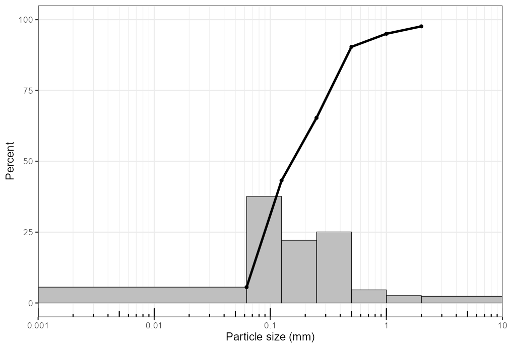
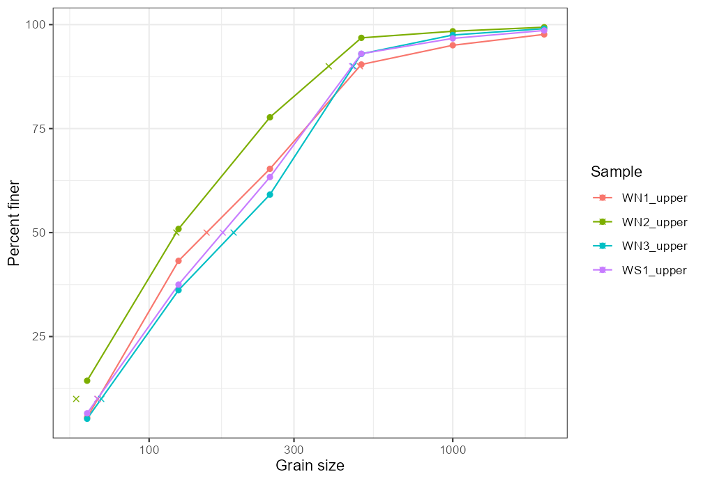
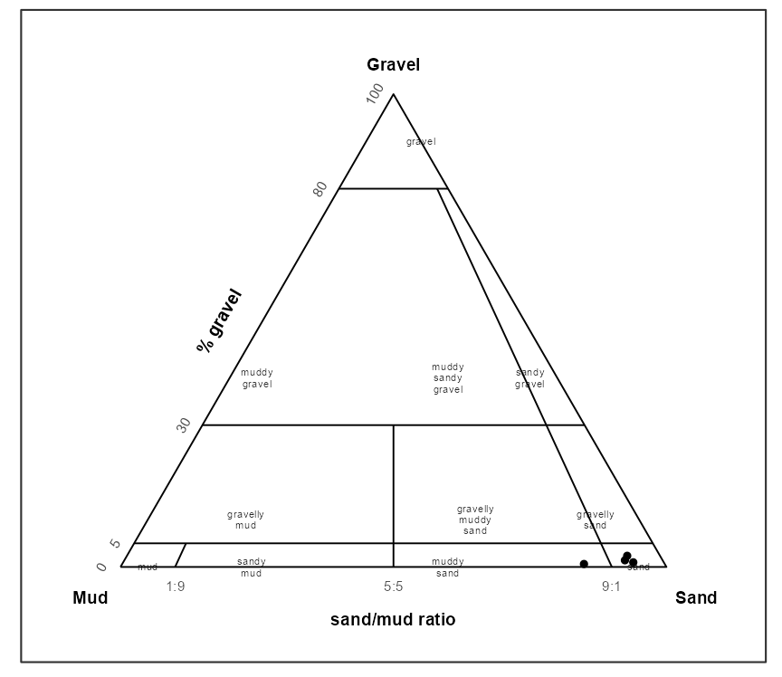
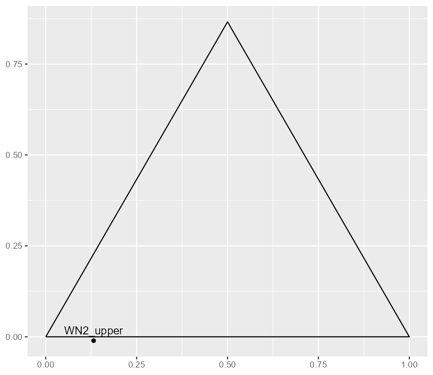

# grainsizeR

grainsizeR provides R tools for sediment grain-size analysis. It reads
retained grain-size distributions, validates them as `gsd_tbl` objects,
calculates D-values and common summary statistics, builds particle-size
fraction summaries, classifies supported texture systems, and creates
distribution, cumulative, fraction, and texture ternary plots.

## Installation

``` r
install.packages("remotes")
remotes::install_github("Gavin987/grainsizeR")
```

grainsizeR is under active development. Built-in official texture
polygon datasets are not bundled yet; USDA major texture and
GRADISTAT-style texture classification are available through internal
rule helpers.

## Quick Start

The bundled examples include a wide dry-sieve table and a long-format
sieve-plus-hydrometer table.

``` r
library(grainsizeR)

wide_path <- system.file("extdata", "grain.wide.csv", package = "grainsizeR")
long_path <- system.file("extdata", "grain.long.csv", package = "grainsizeR")

wide <- read_gsd(wide_path, format = "wide")
long <- read_gsd(long_path)
```

Once imported, use the same object with summary and plotting functions:

``` r
gs_diagnostics(wide, output = "summary")
gs_d_values(long, probs = c(10, 50, 90), extrapolate = "warn_linear")
gs_folk_ward(long, extrapolate = "warn_linear")
gs_fractions_wide(wide, scheme = "gravel_sand_mud")
```

## Grain-Size Plots

Distribution and cumulative plots are single-sample displays. Select one
sample with `sample_id`, then loop over samples or arrange returned
plots externally for multi-sample figures. Metric plots use a log10
particle-size axis in millimetres by default; `particle_unit = "um"`
displays micrometres.

``` r
plot_distribution(wide, sample_id = "WN1_upper", cumulative = TRUE)
plot_cumulative(
  wide,
  sample_id = "WN1_upper",
  show_percentiles = c(10, 50, 90),
  extrapolate = "warn_linear"
)
```





## Fraction Summaries

The dry-sieve wide example demonstrates the GRADISTAT-style
`Gravel`/`Sand`/`Mud` workflow. More detailed Wentworth-style fractions
are available when the input resolves the required class boundaries.

``` r
plot_fractions(
  wide,
  scheme = "gravel_sand_mud",
  sample_id = c("WN1_upper", "WN2_upper", "WN3_upper", "WS1_upper"),
  fill_palette = "YlOrBr"
)
```


## Texture Ternary Plots

GRADISTAT-style gravel-sand-mud ternary plots use `Gravel`, `Mud`, and
`Sand` apex labels with gravel and sand:mud ratio guides. USDA ternary
plots use external percent-axis labels and the 12 major USDA texture
classes. The USDA plot below combines labeled demonstration points with
bundled example points where valid sand-silt-clay fractions are
resolvable.

``` r
plot_texture_ternary(gsm, scheme = "gradistat", basis = "gravel_sand_mud")
plot_texture_ternary(usda_samples, scheme = "usda_tt")
```



## Parameter Summaries

`gs_parameters()` collects common grain-size outputs into ordinary R
tables for reporting or export with standard R tools.

``` r
summary <- gs_parameters(
  long,
  parameters = c("d_values", "indices", "folk_ward", "fractions"),
  fraction_scheme = "gradistat",
  extrapolate = "warn_linear"
)

write.csv(summary, "grain_size_summary.csv", row.names = FALSE)
```

## End-to-End Workflow

The full vignettes show complete workflows. A compact analysis usually
reads data, checks resolvability, calculates statistics, then creates
figures:

``` r
long <- read_gsd(long_path)

gs_diagnostics(long, output = "summary")
gs_parameters(
  long,
  parameters = c("d_values", "indices", "folk_ward", "fractions"),
  fraction_scheme = "gradistat",
  extrapolate = "warn_linear"
)

plot_distribution(long, sample_id = "WN1_upper", cumulative = TRUE)
plot_cumulative(long, sample_id = "WN1_upper", extrapolate = "warn_linear")
plot_fractions(long, scheme = "wentworth_major")
plot_texture_ternary(long, scheme = "usda_tt")
```

`plot_texture_triangle()` remains available as a stable compatibility
name for texture ternary plots; `plot_texture_ternary()` is preferred in
new code.

## Further Reading

Use the vignettes for full workflows and methodological detail:

- `vignette("grain-size-workflow")`: import, diagnostics, summaries, and
  plots.
- `vignette("texture-classification")`: USDA and GRADISTAT-style texture
  classification and ternary plots.
- `vignette("replacing-gradistat-g2sd")`: R-native workflows for tasks
  commonly handled with GRADISTAT or G2Sd-style analysis.
- `vignette("method-validation")`: interpolation conventions, open-tail
  behavior, and numerical validation examples.

Function documentation gives argument-level detail, including explicit
extrapolation and open-ended class handling.

## License and Development Status

grainsizeR is licensed under the MIT License. Package code and original
package documentation are MIT-licensed.

The package is in active development. It does not copy GRADISTAT VBA
code, G2Sd source code, workbook layouts, `soiltexture` code, or bundled
official texture polygon coordinates. Built-in official texture polygon
datasets may be added only after independent source review,
reconstruction, validation, tests, and documentation.

The public provenance notes document source boundaries before any future
built-in texture polygon dataset is considered.
