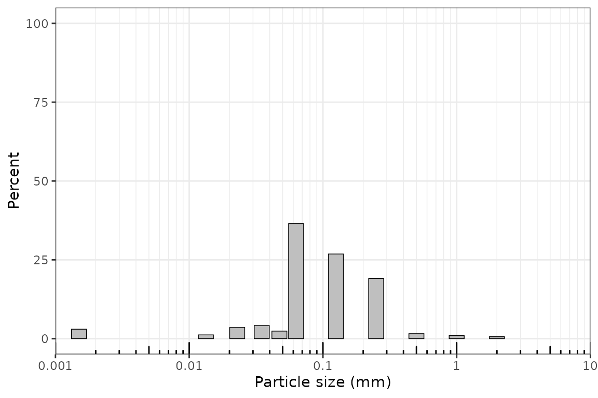
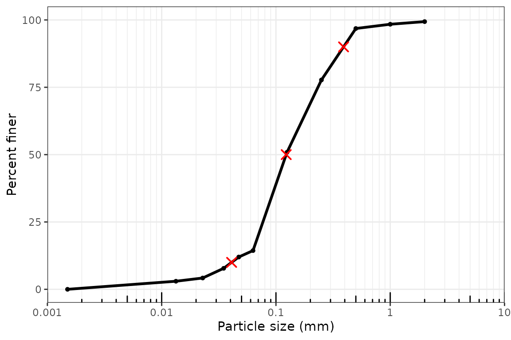
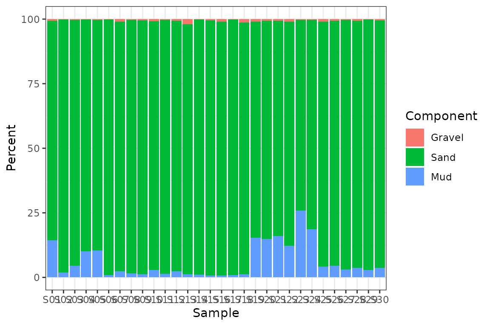
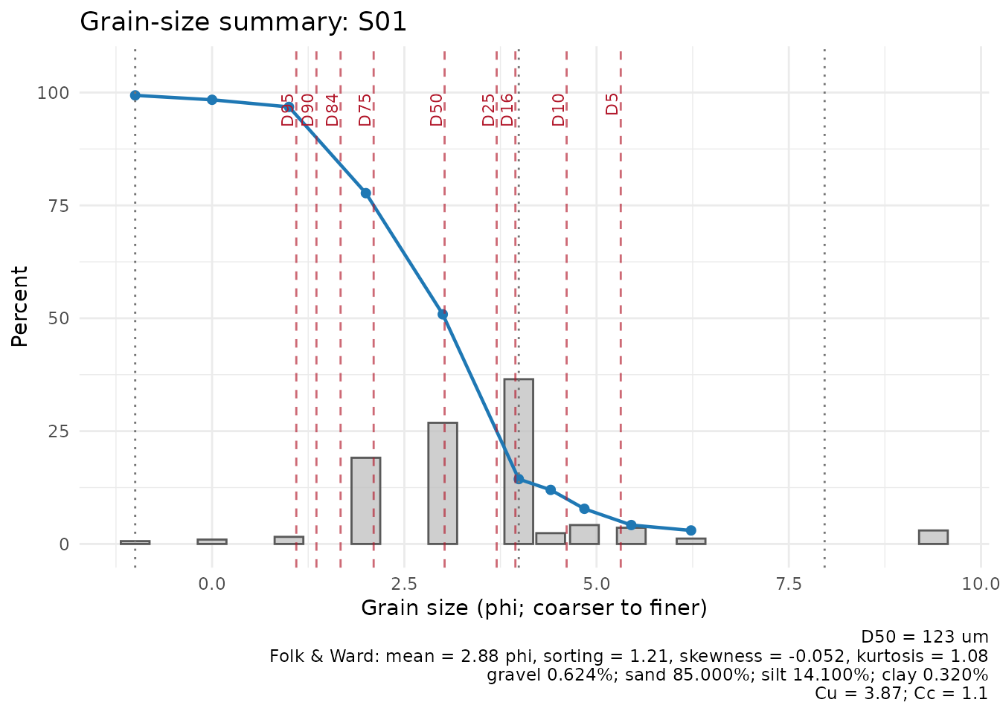

# Basic grainsizeR Workflow

## Introduction

This vignette walks through a complete sediment grain-size analysis with
grainsizeR. The examples use package data stored in `inst/extdata`.

For more detail on table layouts versus measurement setups, including
the dry-sieve and sieve + hydrometer example files, see the table
layouts and measurement workflows vignette.

``` r
library(grainsizeR)
```

## Reading Long-Format Data

Long-format input has one row per sample and grain-size class.

``` r
long_file <- system.file("extdata", "grain.long.csv", package = "grainsizeR")

gs <- read_gsd(
  long_file,
  format = "long",
  sample_col = "sample",
  size_col = "size",
  value_col = "proportion",
  size_unit = "mm",
  value_type = "proportion"
)

head(gs)
#> # A tibble: 6 × 13
#>   sample_id bin_id raw_size_um size_lower_um size_upper_um size_mid_um
#>   <chr>      <int>       <dbl>         <dbl>         <dbl>       <dbl>
#> 1 S01            1        2000          2000            NA        NA  
#> 2 S01            2        1000          1000          2000      1414. 
#> 3 S01            3         500           500          1000       707. 
#> 4 S01            4         250           250           500       354. 
#> 5 S01            5         125           125           250       177. 
#> 6 S01            6          63            63           125        88.7
#> # ℹ 7 more variables: size_mid_phi <dbl>, retained_percent <dbl>,
#> #   cum_finer_percent <dbl>, cum_coarser_percent <dbl>, is_open_lower <lgl>,
#> #   is_open_upper <lgl>, measurement_method <chr>
```

## Reading Wide-Format Data

Wide input stores size classes in rows and samples in columns. Terminal
fine rows such as `<0.0625` in a strict Wentworth-style example are
supported and become open-ended fine classes. G2Sd-style wide tables
often store particle sizes in row names and samples in columns. Convert
row names to a size column and use `size_unit = "auto"` or
`size_unit = "um"` when importing micrometre-scale labels.

``` r
wide_file <- system.file("extdata", "grain.wide.csv", package = "grainsizeR")

gs_wide <- read_gsd(
  wide_file,
  format = "wide",
  size_col = 1,
  size_unit = "mm",
  value_type = "percent"
)

head(gs_wide)
#> # A tibble: 6 × 13
#>   sample_id bin_id raw_size_um size_lower_um size_upper_um size_mid_um
#>   <chr>      <int>       <dbl>         <dbl>         <dbl>       <dbl>
#> 1 S01            1        2000          2000            NA        NA  
#> 2 S01            2        1000          1000          2000      1414. 
#> 3 S01            3         500           500          1000       707. 
#> 4 S01            4         250           250           500       354. 
#> 5 S01            5         125           125           250       177. 
#> 6 S01            6          63            63           125        88.7
#> # ℹ 7 more variables: size_mid_phi <dbl>, retained_percent <dbl>,
#> #   cum_finer_percent <dbl>, cum_coarser_percent <dbl>, is_open_lower <lgl>,
#> #   is_open_upper <lgl>, measurement_method <chr>
```

## The `gsd_tbl` Object

`gsd_tbl` stores retained percentages, finite class boundaries,
cumulative percent finer and coarser values, and open-ended class flags.

``` r
is_gsd_tbl(gs)
#> [1] TRUE
validate_gsd_tbl(gs)
```

## Data Quality Diagnostics

[`gs_diagnostics()`](https://Gavin987.github.io/grainsizeR/reference/gs_diagnostics.md)
is useful after reading data and before calculating summary tables. It
reports retained-total checks, open-ended tails, unresolved D-values,
threshold interpolation limits, and fraction-scheme resolvability. The
example wide file is a dry-sieve dataset stored in a wide layout, so
fine clay/silt thresholds may be unresolved unless finer measurements or
explicit extrapolation are supplied.

``` r
head(gs_diagnostics(gs_wide, output = "summary"))
#> # A tibble: 6 × 8
#>   sample_id  n_ok n_warning n_error n_info has_error has_warning overall_status
#>   <chr>     <int>     <int>   <int>  <int> <lgl>     <lgl>       <chr>         
#> 1 S01          16        12       0      3 FALSE     TRUE        warning       
#> 2 S02          18         9       0      4 FALSE     TRUE        warning       
#> 3 S03          18         9       0      4 FALSE     TRUE        warning       
#> 4 S04          16        12       0      3 FALSE     TRUE        warning       
#> 5 S05          16        12       0      3 FALSE     TRUE        warning       
#> 6 S06          18         9       0      4 FALSE     TRUE        warning
head(gs_diagnostics(
  gs,
  d_values = c(5, 10, 50, 90, 95),
  fraction_schemes = c("wentworth_major", "usda", "uk_ssew")
))
#> # A tibble: 6 × 9
#>   sample_id check               status severity value expected parameter message
#>   <chr>     <chr>               <chr>  <chr>    <chr> <chr>    <chr>     <chr>  
#> 1 S01       missing_values      ok     none     0     finite … NA        Retain…
#> 2 S01       negative_values     ok     none     0     no nega… NA        No neg…
#> 3 S01       zero_total          ok     none     100   > 0      NA        The re…
#> 4 S01       retained_total      ok     none     100   100 +/-… NA        Retain…
#> 5 S01       duplicate_size_cla… ok     none     0     0 dupli… NA        No dup…
#> 6 S01       size_order          ok     none     decr… coarse-… NA        Size c…
#> # ℹ 1 more variable: recommendation <chr>
```

## Cumulative Curves and D-Values

`D_p` is the grain size at which `p` percent of the sample is finer.

``` r
head(gs_cumulative(gs))
#> # A tibble: 6 × 7
#>   sample_id boundary_id boundary_um boundary_mm boundary_phi percent_finer
#>   <chr>           <int>       <dbl>       <dbl>        <dbl>         <dbl>
#> 1 S01                 1        2000       2            -1             99.4
#> 2 S01                 2        1000       1             0             98.4
#> 3 S01                 3         500       0.5           1             96.8
#> 4 S01                 4         250       0.25          2             77.7
#> 5 S01                 5         125       0.125         3             50.9
#> 6 S01                 6          63       0.063         3.99          14.4
#> # ℹ 1 more variable: percent_coarser <dbl>
head(gs_d_values(gs, probs = c(10, 50, 90)))
#> # A tibble: 6 × 7
#>   sample_id percentile grain_size_um grain_size_mm grain_size_phi
#>   <chr>          <dbl>         <dbl>         <dbl>          <dbl>
#> 1 S01               10          40.9        0.0409           4.61
#> 2 S01               50         123.         0.123            3.02
#> 3 S01               90         390.         0.390            1.36
#> 4 S02               10          77.6        0.0776           3.69
#> 5 S02               50         175.         0.175            2.51
#> 6 S02               90         412.         0.412            1.28
#> # ℹ 2 more variables: interpolation_scale <chr>, extrapolated <lgl>
```

## Arbitrary Threshold Interpolation

[`gs_percent_finer()`](https://Gavin987.github.io/grainsizeR/reference/gs_percent_finer.md)
estimates percent finer at arbitrary thresholds, including thresholds
that were not measured exactly, as long as the threshold is bracketed by
finite class boundaries. Terminal open-ended classes require explicit
extrapolation or unresolved-value handling.

``` r
head(suppressWarnings(gs_percent_finer(
  gs,
  sizes = c(2, 20, 50, 60, 63),
  size_unit = "um",
  extrapolate = "warn_linear"
)))
#> # A tibble: 6 × 8
#>   sample_id threshold_um threshold_mm threshold_phi percent_finer
#>   <chr>            <dbl>        <dbl>         <dbl>         <dbl>
#> 1 S01                  2        0.002          8.97         -1.22
#> 2 S01                 20        0.02           5.64          3.90
#> 3 S01                 50        0.05           4.32         12.5 
#> 4 S01                 60        0.06           4.06         14.0 
#> 5 S01                 63        0.063          3.99         14.4 
#> 6 S02                  2        0.002          8.97       -131.  
#> # ℹ 3 more variables: percent_coarser <dbl>, interpolation_scale <chr>,
#> #   extrapolated <lgl>
```

## Grain-Size Indices

``` r
head(suppressWarnings(gs_grain_size_indices(
  gs,
  extrapolate = "warn_linear"
)))
#> # A tibble: 6 × 15
#>   sample_id D10_um D25_um D30_um D50_um D60_um D75_um    Cu    Cc So_trask
#>   <chr>      <dbl>  <dbl>  <dbl>  <dbl>  <dbl>  <dbl> <dbl> <dbl>    <dbl>
#> 1 S01         40.9   76.9   84.5   123.   158.   233.  3.87 1.10      1.74
#> 2 S02         77.6  114.   128.    175.   205.   267.  2.64 1.03      1.53
#> 3 S03         69.5   91.3  100.    151.   193.   278.  2.77 0.748     1.74
#> 4 S04         60.2   81.2   88.5   125.   167.   258.  2.77 0.780     1.78
#> 5 S05         62.2   80.1   87.2   123.   167.   270.  2.69 0.731     1.84
#> 6 S06         76.1  104.   115.    216.   273.   346.  3.59 0.641     1.82
#> # ℹ 5 more variables: Sk_trask <dbl>, fine_content_percent <dbl>,
#> #   fine_threshold_um <dbl>, fine_equivalent <dbl>, interpolation_scale <chr>
```

## Folk and Ward Statistics

``` r
head(suppressWarnings(gs_folk_ward(
  gs,
  extrapolate = "warn_linear"
)))
#> # A tibble: 6 × 26
#>   sample_id D5_um D16_um D25_um D50_um D75_um D84_um D95_um D5_phi D16_phi
#>   <chr>     <dbl>  <dbl>  <dbl>  <dbl>  <dbl>  <dbl>  <dbl>  <dbl>   <dbl>
#> 1 S01        25.1   64.9   76.9   123.   233.   314.   468.   5.31    3.94
#> 2 S02        68.2   90.7  114.    175.   267.   346.   476.   3.87    3.46
#> 3 S03        63.5   77.5   91.3   151.   278.   347.   455.   3.98    3.69
#> 4 S04        32.3   69.6   81.2   125.   258.   333.   456.   4.95    3.85
#> 5 S05        35.3   68.7   80.1   123.   270.   347.   472.   4.82    3.86
#> 6 S06        68.5   86.2  104.    216.   346.   399.   475.   3.87    3.54
#> # ℹ 16 more variables: D25_phi <dbl>, D50_phi <dbl>, D75_phi <dbl>,
#> #   D84_phi <dbl>, D95_phi <dbl>, mean_fw_phi <dbl>, mean_fw_um <dbl>,
#> #   sorting_fw_phi <dbl>, skewness_fw <dbl>, kurtosis_fw <dbl>,
#> #   interpolation_scale <chr>, any_extrapolated <lgl>, mean_size_class <chr>,
#> #   sorting_class <chr>, skewness_class <chr>, kurtosis_class <chr>
```

## Moment Statistics and Open-Ended Classes

Moment statistics require an explicit open-end policy.
`open_end = "extend_phi"` estimates open-ended midpoints by extending
adjacent intervals in phi space.

``` r
head(suppressWarnings(gs_moments(
  gs,
  open_end = "extend_phi"
)))
#> # A tibble: 6 × 14
#>   sample_id moment_method   mean_moment mean_moment_unit mean_moment_um
#>   <chr>     <chr>                 <dbl> <chr>                     <dbl>
#> 1 S01       logarithmic_phi        2.97 phi                        127.
#> 2 S02       logarithmic_phi        2.49 phi                        179.
#> 3 S03       logarithmic_phi        2.65 phi                        159.
#> 4 S04       logarithmic_phi        2.90 phi                        134.
#> 5 S05       logarithmic_phi        2.85 phi                        139.
#> 6 S06       logarithmic_phi        2.36 phi                        194.
#> # ℹ 9 more variables: mean_moment_phi <dbl>, sd_moment <dbl>,
#> #   sd_moment_unit <chr>, skewness_moment <dbl>, kurtosis_moment <dbl>,
#> #   retained_percent_used <dbl>, open_end <chr>, open_end_estimated <lgl>,
#> #   open_end_omitted <lgl>
```

## Grain-Size Fractions and Particle-Size Systems

``` r
head(gs_fractions_wide(gs, scheme = "wentworth_major"))
#> # A tibble: 6 × 4
#>   sample_id gravel_percent sand_percent mud_percent
#>   <chr>              <dbl>        <dbl>       <dbl>
#> 1 S01                0.624         85.1      14.3  
#> 2 S02                0.224         97.8       1.93 
#> 3 S03                0.312         95.1       4.60 
#> 4 S04                0.153         89.7      10.2  
#> 5 S05                0.295         89.4      10.4  
#> 6 S06                0.230         98.8       0.964
particle_size_systems()
#> # A tibble: 9 × 15
#>   system_id     system_name country_or_region domain clay_upper_um silt_upper_um
#>   <chr>         <chr>       <chr>             <chr>          <dbl>         <dbl>
#> 1 wentworth_ma… Wentworth … International     sedim…            NA            NA
#> 2 gradistat     GRADISTAT … International     sedim…             4            63
#> 3 usda          USDA textu… United States     soil …             2            50
#> 4 isss          Internatio… International     soil …             2            20
#> 5 uk_ssew       UK SSEW pa… United Kingdom    soil …             2            60
#> 6 hypres        HYPRES par… Europe            soil …             2            50
#> 7 germany_63    Germany 63… Germany           soil …             2            63
#> 8 australia_20  Australia … Australia         soil …             2            20
#> 9 sweden_60     Sweden 60 … Sweden            soil …             2            60
#> # ℹ 9 more variables: sand_upper_um <dbl>, gravel_lower_um <dbl>,
#> #   clay_range <chr>, silt_range <chr>, sand_range <chr>, gravel_range <chr>,
#> #   source_status <chr>, source_reference <chr>, notes <chr>
```

## Creating a Report Table

[`gs_parameters()`](https://Gavin987.github.io/grainsizeR/reference/gs_parameters.md)
is the recommended way to create a compact grain-size summary table for
reporting. It can combine D-values, grain-size indices, Folk and Ward
statistics, moment statistics, and fractions in one row per sample.

``` r
report_table <- suppressWarnings(gs_parameters(
  gs,
  parameters = c("d_values", "indices", "folk_ward", "fractions"),
  fraction_scheme = "gradistat",
  extrapolate = "warn_linear"
))

head(report_table)
#> # A tibble: 6 × 41
#>   sample_id D5_um D10_um D16_um D25_um D50_um D75_um D84_um D90_um D95_um D30_um
#>   <chr>     <dbl>  <dbl>  <dbl>  <dbl>  <dbl>  <dbl>  <dbl>  <dbl>  <dbl>  <dbl>
#> 1 S01        25.1   40.9   64.9   76.9   123.   233.   314.   390.   468.   84.5
#> 2 S02        68.2   77.6   90.7  114.    175.   267.   346.   412.   476.  128. 
#> 3 S03        63.5   69.5   77.5   91.3   151.   278.   347.   402.   455.  100. 
#> 4 S04        32.3   60.2   69.6   81.2   125.   258.   333.   395.   456.   88.5
#> 5 S05        35.3   62.2   68.7   80.1   123.   270.   347.   410.   472.   87.2
#> 6 S06        68.5   76.1   86.2  104.    216.   346.   399.   439.   475.  115. 
#> # ℹ 30 more variables: D60_um <dbl>, Cu <dbl>, Cc <dbl>, So_trask <dbl>,
#> #   Sk_trask <dbl>, fine_content_percent <dbl>, fine_threshold_um <dbl>,
#> #   fine_equivalent <dbl>, interpolation_scale <chr>, D5_phi <dbl>,
#> #   D16_phi <dbl>, D25_phi <dbl>, D50_phi <dbl>, D75_phi <dbl>, D84_phi <dbl>,
#> #   D95_phi <dbl>, mean_fw_phi <dbl>, mean_fw_um <dbl>, sorting_fw_phi <dbl>,
#> #   skewness_fw <dbl>, kurtosis_fw <dbl>, any_extrapolated <lgl>,
#> #   mean_size_class <chr>, sorting_class <chr>, skewness_class <chr>, …
```

[`plot_gradistat_summary()`](https://Gavin987.github.io/grainsizeR/reference/plot_gradistat_summary.md)
is for visual diagnostics. Standard R functions can export tables when
needed:

``` r
write.csv(report_table, "grain_size_summary.csv", row.names = FALSE)
```

Keeping export in standard R workflows avoids tying grainsizeR to a
specific report format.

## Basic Plots

``` r
plot_distribution(gs, sample = "S01")
```



``` r
plot_cumulative(gs, sample = "S01", show_percentiles = c(10, 50, 90), extrapolate = "warn_linear")
```



``` r
plot_fractions(gs, scheme = "wentworth_major")
```



[`plot_gradistat_summary()`](https://Gavin987.github.io/grainsizeR/reference/plot_gradistat_summary.md)
provides a single-sample diagnostic plot that combines retained
distribution, cumulative percent finer, D-value markers, and summary
statistics. It is inspired by common sediment grain-size reporting
needs, not copied from GRADISTAT software.

``` r
suppressWarnings(plot_gradistat_summary(
  gs,
  sample_id = "S01",
  extrapolate = "warn_linear"
))
```



## Recommended Reporting Workflow

For reproducible reporting, state the input format, measurement units,
interpolation scale, open-end policy, fraction scheme, and whether any
values were extrapolated or unresolved.
