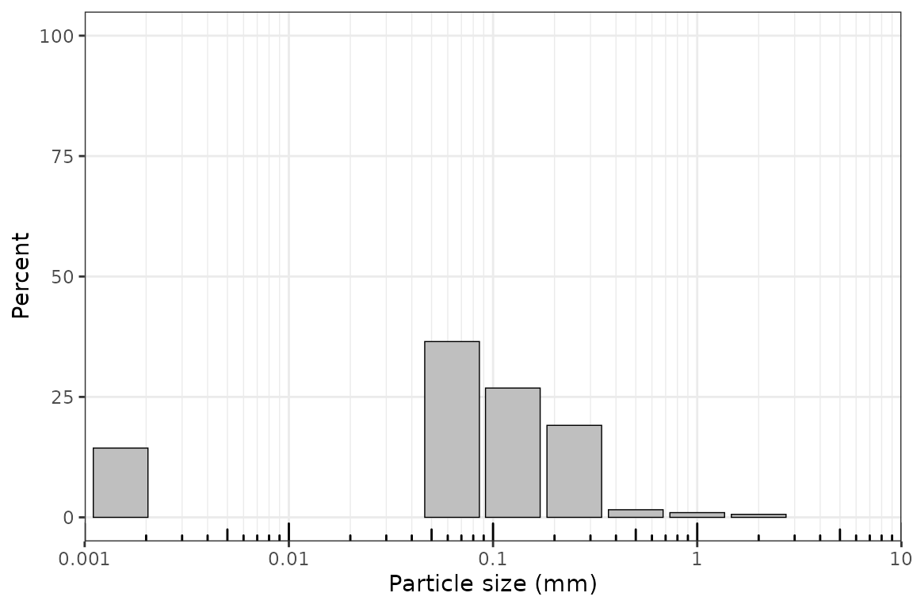
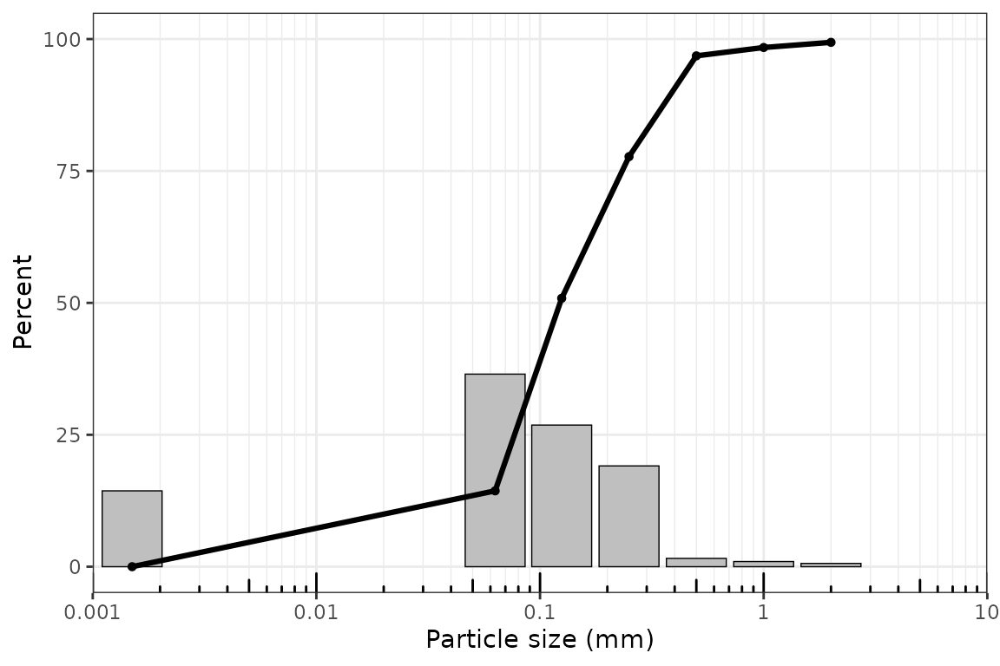
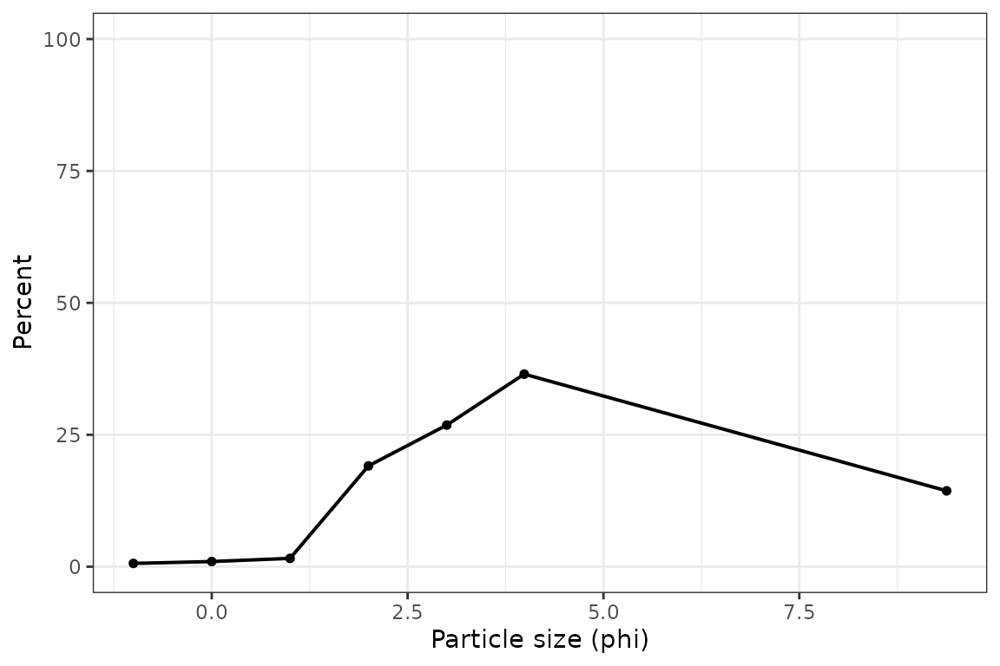
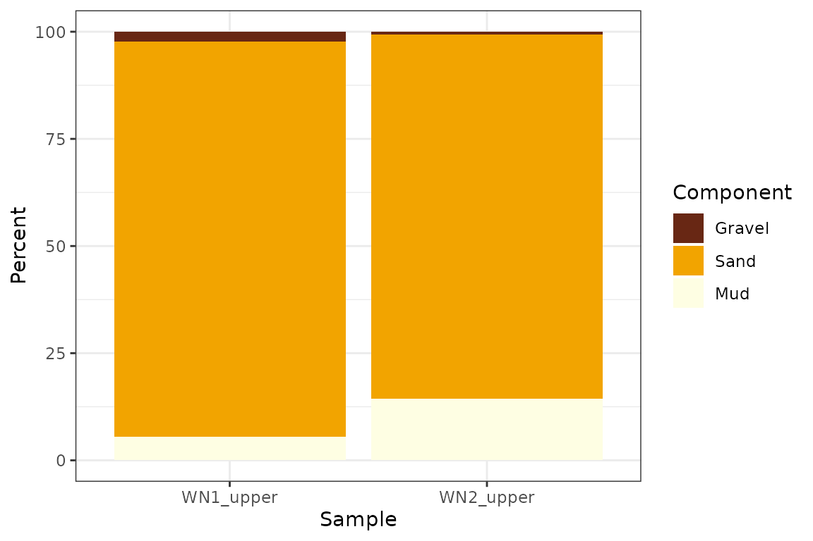

# Grain-Size Analysis Workflow

## Overview

This vignette shows a compact end-to-end grain-size workflow with
grainsizeR. It uses the example files installed with the package and
keeps each step as an ordinary R object so results can be checked,
joined, plotted, and exported with standard R tools.

This vignette uses preferred public functions in the main workflow.
Short aliases are available for interactive use, but the full function
names are easier to read in scripts and reports. CRAN readiness is not
claimed here.

``` r
library(grainsizeR)
```

## Reading Long and Wide Grain-Size Data

Long input has one row per sample and size class. Wide input has one
size column and one column per sample.

``` r
long_file <- system.file("extdata", "grain.long.csv", package = "grainsizeR")
wide_file <- system.file("extdata", "grain.wide.csv", package = "grainsizeR")

gs <- read_gsd(
  long_file,
  format = "long",
  sample_col = "sample",
  size_col = "size",
  value_col = "proportion",
  size_unit = "mm",
  value_type = "proportion"
)

gs_wide <- read_gsd_wide(
  wide_file,
  size_col = 1,
  size_unit = "mm",
  value_type = "percent"
)

head(gs)
#> # A tibble: 6 × 13
#>   sample_id bin_id raw_size_um size_lower_um size_upper_um size_mid_um
#>   <chr>      <int>       <dbl>         <dbl>         <dbl>       <dbl>
#> 1 S01            1        2000          2000            NA        NA  
#> 2 S01            2        1000          1000          2000      1414. 
#> 3 S01            3         500           500          1000       707. 
#> 4 S01            4         250           250           500       354. 
#> 5 S01            5         125           125           250       177. 
#> 6 S01            6          63            63           125        88.7
#> # ℹ 7 more variables: size_mid_phi <dbl>, retained_percent <dbl>,
#> #   cum_finer_percent <dbl>, cum_coarser_percent <dbl>, is_open_lower <lgl>,
#> #   is_open_upper <lgl>, measurement_method <chr>
```

## Inspecting and Validating `gsd_tbl` Objects

[`read_gsd()`](https://Gavin987.github.io/grainsizeR/reference/read_gsd.md)
and
[`read_gsd_wide()`](https://Gavin987.github.io/grainsizeR/reference/read_gsd_wide.md)
return `gsd_tbl` objects. Diagnostics help identify open-ended classes
and threshold-resolution limits before running a large analysis.

``` r
is_gsd_tbl(gs)
#> [1] TRUE
head(gs_diagnostics(gs, output = "summary"))
#> # A tibble: 6 × 8
#>   sample_id  n_ok n_warning n_error n_info has_error has_warning overall_status
#>   <chr>     <int>     <int>   <int>  <int> <lgl>     <lgl>       <chr>         
#> 1 S01          28         1       0      2 FALSE     TRUE        warning       
#> 2 S02          22         5       0      4 FALSE     TRUE        warning       
#> 3 S03          22         5       0      4 FALSE     TRUE        warning       
#> 4 S04          28         1       0      2 FALSE     TRUE        warning       
#> 5 S05          28         1       0      2 FALSE     TRUE        warning       
#> 6 S06          22         5       0      4 FALSE     TRUE        warning
```

## Cumulative Percentages

[`gs_cumulative()`](https://Gavin987.github.io/grainsizeR/reference/gs_cumulative.md)
returns finite-boundary cumulative percentages by sample.

``` r
head(gs_cumulative(gs))
#> # A tibble: 6 × 7
#>   sample_id boundary_id boundary_um boundary_mm boundary_phi percent_finer
#>   <chr>           <int>       <dbl>       <dbl>        <dbl>         <dbl>
#> 1 S01                 1        2000       2            -1             99.4
#> 2 S01                 2        1000       1             0             98.4
#> 3 S01                 3         500       0.5           1             96.8
#> 4 S01                 4         250       0.25          2             77.7
#> 5 S01                 5         125       0.125         3             50.9
#> 6 S01                 6          63       0.063         3.99          14.4
#> # ℹ 1 more variable: percent_coarser <dbl>
```

## D-Values and GRADISTAT-Style D-Spread Descriptors

Use
[`gs_d_values()`](https://Gavin987.github.io/grainsizeR/reference/gs_d_values.md)
for requested percentiles and
[`gs_d_spread()`](https://Gavin987.github.io/grainsizeR/reference/gs_d_spread.md)
for GRADISTAT-style D-ratio and D-difference descriptors. Open-ended
tails require an explicit extrapolation choice when a requested value
falls outside resolved boundaries.

``` r
head(suppressWarnings(gs_d_values(
  gs,
  probs = c(10, 50, 90),
  extrapolate = "warn_linear"
)))
#> # A tibble: 6 × 7
#>   sample_id percentile grain_size_um grain_size_mm grain_size_phi
#>   <chr>          <dbl>         <dbl>         <dbl>          <dbl>
#> 1 S01               10          40.9        0.0409           4.61
#> 2 S01               50         123.         0.123            3.02
#> 3 S01               90         390.         0.390            1.36
#> 4 S02               10          77.6        0.0776           3.69
#> 5 S02               50         175.         0.175            2.51
#> 6 S02               90         412.         0.412            1.28
#> # ℹ 2 more variables: interpolation_scale <chr>, extrapolated <lgl>

head(suppressWarnings(gs_d_spread(
  gs,
  extrapolate = "warn_linear"
)))
#> # A tibble: 6 × 14
#>   sample_id   D10   D25   D50   D75   D90 d_value_unit D90_D10_ratio
#>   <chr>     <dbl> <dbl> <dbl> <dbl> <dbl> <chr>                <dbl>
#> 1 S01        40.9  76.9  123.  233.  390. um                    9.54
#> 2 S02        77.6 114.   175.  267.  412. um                    5.30
#> 3 S03        69.5  91.3  151.  278.  402. um                    5.79
#> 4 S04        60.2  81.2  125.  258.  395. um                    6.56
#> 5 S05        62.2  80.1  123.  270.  410. um                    6.60
#> 6 S06        76.1 104.   216.  346.  439. um                    5.77
#> # ℹ 6 more variables: D90_minus_D10 <dbl>, D75_D25_ratio <dbl>,
#> #   D75_minus_D25 <dbl>, D90_D10_log_ratio <dbl>, D75_D25_log_ratio <dbl>,
#> #   any_extrapolated <lgl>
```

## Folk and Ward Graphical Statistics

[`gs_folk_ward()`](https://Gavin987.github.io/grainsizeR/reference/gs_folk_ward.md)
calculates graphical statistics from percentile estimates.

``` r
head(suppressWarnings(gs_folk_ward(
  gs,
  extrapolate = "warn_linear"
)))
#> # A tibble: 6 × 26
#>   sample_id D5_um D16_um D25_um D50_um D75_um D84_um D95_um D5_phi D16_phi
#>   <chr>     <dbl>  <dbl>  <dbl>  <dbl>  <dbl>  <dbl>  <dbl>  <dbl>   <dbl>
#> 1 S01        25.1   64.9   76.9   123.   233.   314.   468.   5.31    3.94
#> 2 S02        68.2   90.7  114.    175.   267.   346.   476.   3.87    3.46
#> 3 S03        63.5   77.5   91.3   151.   278.   347.   455.   3.98    3.69
#> 4 S04        32.3   69.6   81.2   125.   258.   333.   456.   4.95    3.85
#> 5 S05        35.3   68.7   80.1   123.   270.   347.   472.   4.82    3.86
#> 6 S06        68.5   86.2  104.    216.   346.   399.   475.   3.87    3.54
#> # ℹ 16 more variables: D25_phi <dbl>, D50_phi <dbl>, D75_phi <dbl>,
#> #   D84_phi <dbl>, D95_phi <dbl>, mean_fw_phi <dbl>, mean_fw_um <dbl>,
#> #   sorting_fw_phi <dbl>, skewness_fw <dbl>, kurtosis_fw <dbl>,
#> #   interpolation_scale <chr>, any_extrapolated <lgl>, mean_size_class <chr>,
#> #   sorting_class <chr>, skewness_class <chr>, kurtosis_class <chr>
```

## Moment Statistics

Moment statistics require explicit open-end handling. This example
extends terminal classes by one phi unit.

``` r
head(suppressWarnings(gs_moments(
  gs,
  open_end = "extend_phi"
)))
#> # A tibble: 6 × 14
#>   sample_id moment_method   mean_moment mean_moment_unit mean_moment_um
#>   <chr>     <chr>                 <dbl> <chr>                     <dbl>
#> 1 S01       logarithmic_phi        2.97 phi                        127.
#> 2 S02       logarithmic_phi        2.49 phi                        179.
#> 3 S03       logarithmic_phi        2.65 phi                        159.
#> 4 S04       logarithmic_phi        2.90 phi                        134.
#> 5 S05       logarithmic_phi        2.85 phi                        139.
#> 6 S06       logarithmic_phi        2.36 phi                        194.
#> # ℹ 9 more variables: mean_moment_phi <dbl>, sd_moment <dbl>,
#> #   sd_moment_unit <chr>, skewness_moment <dbl>, kurtosis_moment <dbl>,
#> #   retained_percent_used <dbl>, open_end <chr>, open_end_estimated <lgl>,
#> #   open_end_omitted <lgl>
```

## Modes and Sample Modality

[`gs_modes()`](https://Gavin987.github.io/grainsizeR/reference/gs_modes.md)
reports ranked retained-class modes and an operational modality label.

``` r
head(gs_modes(gs))
#> # A tibble: 6 × 12
#>   sample_id sample_modality  mode_rank mode_size_mm mode_size_um mode_phi
#>   <chr>     <chr>                <int>        <dbl>        <dbl>    <dbl>
#> 1 S01       trimodal_or_more         1       0.0887         88.7     3.49
#> 2 S01       trimodal_or_more         2       0.177         177.      2.5 
#> 3 S01       trimodal_or_more         3       0.354         354.      1.5 
#> 4 S02       unimodal                 1       0.177         177.      2.5 
#> 5 S02       unimodal                 2       0.0887         88.7     3.49
#> 6 S02       unimodal                 3       0.354         354.      1.5 
#> # ℹ 6 more variables: mode_class_lower_mm <dbl>, mode_class_upper_mm <dbl>,
#> #   mode_percent <dbl>, mode_class_label <chr>, is_open_interval <lgl>,
#> #   mode_status <chr>
```

## Fraction Summaries

Fraction summaries can be returned in long or wide form. The long form
is convenient for plotting and joins; the wide form is convenient for
reports. The dry-sieve wide example is useful for GRADISTAT-style
gravel-sand-mud summaries. The long example includes finer fractions and
is used later for USDA texture workflows.

``` r
head(gs_fractions(gs, scheme = "wentworth_major"))
#> # A tibble: 6 × 11
#>   sample_id scheme         component lower_mm upper_mm lower_um upper_um percent
#>   <chr>     <chr>          <chr>        <dbl>    <dbl>    <dbl>    <dbl>   <dbl>
#> 1 S01       wentworth_maj… gravel      2      Inf        2000      Inf     0.624
#> 2 S01       wentworth_maj… sand        0.0625   2          62.5   2000    85.1  
#> 3 S01       wentworth_maj… mud         0        0.0625      0       62.5  14.3  
#> 4 S02       wentworth_maj… gravel      2      Inf        2000      Inf     0.224
#> 5 S02       wentworth_maj… sand        0.0625   2          62.5   2000    99.8  
#> 6 S02       wentworth_maj… mud         0        0.0625      0       62.5   0    
#> # ℹ 3 more variables: normalize <chr>, interpolation_scale <chr>,
#> #   resolved <lgl>
head(gs_fractions_wide(gs, scheme = "wentworth_major"))
#> # A tibble: 6 × 4
#>   sample_id gravel_percent sand_percent mud_percent
#>   <chr>              <dbl>        <dbl>       <dbl>
#> 1 S01                0.624         85.1        14.3
#> 2 S02                0.224         99.8         0  
#> 3 S03                0.312         99.7         0  
#> 4 S04                0.153         89.7        10.2
#> 5 S05                0.295         89.4        10.4
#> 6 S06                0.230         99.8         0
head(gs_fractions_wide(gs_wide, scheme = "gradistat"))
#> # A tibble: 6 × 5
#>   sample_id gravel_percent sand_percent silt_percent clay_percent
#>   <chr>              <dbl>        <dbl>        <dbl>        <dbl>
#> 1 S01                0.624         85.0       14.4              0
#> 2 S02                0.224         97.8        1.93             0
#> 3 S03                0.312         95.1        4.60             0
#> 4 S04                0.153         89.6       10.2              0
#> 5 S05                0.295         88.8       10.9              0
#> 6 S06                0.230         98.8        0.964            0
```

## Descriptive Terms

[`gs_describe_parameters()`](https://Gavin987.github.io/grainsizeR/reference/gs_describe_parameters.md)
adds GRADISTAT-style printout descriptors for calculated Folk and Ward
or moment statistics.

``` r
head(suppressWarnings(gs_describe_parameters(gs)))
#> # A tibble: 6 × 19
#>   sample_id bin_id raw_size_um size_lower_um size_upper_um size_mid_um
#>   <chr>      <int>       <dbl>         <dbl>         <dbl>       <dbl>
#> 1 S01            1        2000          2000            NA        NA  
#> 2 S01            2        1000          1000          2000      1414. 
#> 3 S01            3         500           500          1000       707. 
#> 4 S01            4         250           250           500       354. 
#> 5 S01            5         125           125           250       177. 
#> 6 S01            6          63            63           125        88.7
#> # ℹ 13 more variables: size_mid_phi <dbl>, retained_percent <dbl>,
#> #   cum_finer_percent <dbl>, cum_coarser_percent <dbl>, is_open_lower <lgl>,
#> #   is_open_upper <lgl>, measurement_method <chr>, mean_description <chr>,
#> #   sorting_description <chr>, skewness_description <chr>,
#> #   kurtosis_description <chr>, description_method <chr>,
#> #   description_status <chr>
```

## Quality Flags

[`gs_quality_flags()`](https://Gavin987.github.io/grainsizeR/reference/gs_quality_flags.md)
records advisory flags for supplied sediment loss and open-ended fine
pan fractions.

``` r
head(gs_quality_flags(
  gs,
  sediment_loss_percent = c(S01 = 1.5, S02 = 2.5)
))
#> # A tibble: 6 × 6
#>   sample_id quality_flag      quality_status     quality_value quality_threshold
#>   <chr>     <chr>             <chr>              <chr>         <chr>            
#> 1 S01       sediment_loss     ok                 1.5           <= 2%            
#> 2 S01       open_fine_tail    needs_additional_… TRUE          reported explici…
#> 3 S01       fine_pan_fraction needs_additional_… 2.9952675     1% info; 5% warn…
#> 4 S02       sediment_loss     warning            2.5           > 2%             
#> 5 S02       open_fine_tail    needs_additional_… TRUE          reported explici…
#> 6 S02       fine_pan_fraction needs_additional_… 1.9336191     1% info; 5% warn…
#> # ℹ 1 more variable: quality_message <chr>
```

## Distribution Plots

[`plot_distribution()`](https://Gavin987.github.io/grainsizeR/reference/plot_distribution.md)
returns a ggplot object and supports metric and phi axis scales. The
same function can overlay cumulative percent finer on the retained
size-class bars for a GRADISTAT-style combined display. The examples
below use the dry-sieve wide dataset so the plotted samples align with
the README GRADISTAT-style showcase. Metric displays use particle size
in millimetres on a log-scaled x-axis by default, with major breaks at
0.001, 0.01, 0.1, 1, and 10 mm. Distribution bars are centered at
particle-size classes. Use `particle_unit = "um"` for micrometre axes.
Distribution and cumulative plots show one sample at a time; loop over
samples or arrange returned plots externally for multi-sample figures.
Lower open-ended classes are displayed at 0.0015 mm, or 1.5 um, for
plotting only; calculations are unchanged.

``` r
plot_distribution(gs_wide, sample = "S01")
```



``` r
plot_distribution(gs_wide, sample = "S01", cumulative = TRUE)
```



``` r
plot_distribution(gs_wide, x_scale = "phi", type = "line", sample = "S01")
```



## Cumulative Plots

[`plot_cumulative()`](https://Gavin987.github.io/grainsizeR/reference/plot_cumulative.md)
uses the same particle-size x-axis conventions and can also add D-value
markers.

``` r
suppressWarnings(plot_cumulative(
  gs_wide,
  sample_id = "S01",
  show_percentiles = c(10, 50, 90),
  extrapolate = "warn_linear"
))
```


## Fraction Plots

[`plot_fractions()`](https://Gavin987.github.io/grainsizeR/reference/plot_fractions.md)
draws size-class percentage bars. For dry-sieve GRADISTAT-style
examples, use non-overlapping `Gravel`, `Sand`, and `Mud` fractions.
More detailed Wentworth-style classes are available with
`scheme = "wentworth_detailed"` when the input resolves those
boundaries.

``` r
plot_fractions(
  gs_wide,
  scheme = "gravel_sand_mud",
  sample_id = c("S01", "S02"),
  fill_palette = "YlOrBr"
)
```



## Building a Combined Analysis Table

[`gs_parameters()`](https://Gavin987.github.io/grainsizeR/reference/gs_parameters.md)
collects common outputs into a single table. More specialized helpers
remain available when you need a narrower result.

``` r
combined <- suppressWarnings(gs_parameters(
  gs,
  parameters = c("d_values", "d_spread", "folk_ward", "modes", "descriptors", "quality"),
  d_values = c(10, 50, 90),
  extrapolate = "warn_linear",
  moments_open_end = "extend_phi"
))

head(combined)
#> # A tibble: 6 × 81
#>   sample_id D10_um D50_um D90_um   D10   D25   D50   D75   D90 d_value_unit
#>   <chr>      <dbl>  <dbl>  <dbl> <dbl> <dbl> <dbl> <dbl> <dbl> <chr>       
#> 1 S01         40.9   123.   390.  40.9  76.9  123.  233.  390. um          
#> 2 S02         77.6   175.   412.  77.6 114.   175.  267.  412. um          
#> 3 S03         69.5   151.   402.  69.5  91.3  151.  278.  402. um          
#> 4 S04         60.2   125.   395.  60.2  81.2  125.  258.  395. um          
#> 5 S05         62.2   123.   410.  62.2  80.1  123.  270.  410. um          
#> 6 S06         76.1   216.   439.  76.1 104.   216.  346.  439. um          
#> # ℹ 71 more variables: D90_D10_ratio <dbl>, D90_minus_D10 <dbl>,
#> #   D75_D25_ratio <dbl>, D75_minus_D25 <dbl>, D90_D10_log_ratio <dbl>,
#> #   D75_D25_log_ratio <dbl>, any_extrapolated <lgl>, D5_um <dbl>, D16_um <dbl>,
#> #   D25_um <dbl>, D75_um <dbl>, D84_um <dbl>, D95_um <dbl>, D5_phi <dbl>,
#> #   D16_phi <dbl>, D25_phi <dbl>, D50_phi <dbl>, D75_phi <dbl>, D84_phi <dbl>,
#> #   D95_phi <dbl>, mean_fw_phi <dbl>, mean_fw_um <dbl>, sorting_fw_phi <dbl>,
#> #   skewness_fw <dbl>, kurtosis_fw <dbl>, interpolation_scale <chr>, …
```

## Notes on Open-Ended Tails and Extrapolation

Open-ended terminal classes are common in sediment data. grainsizeR does
not silently turn them into closed intervals. Functions that need
unresolved thresholds require an explicit extrapolation or open-end
option, which makes the assumption visible in the analysis script.
