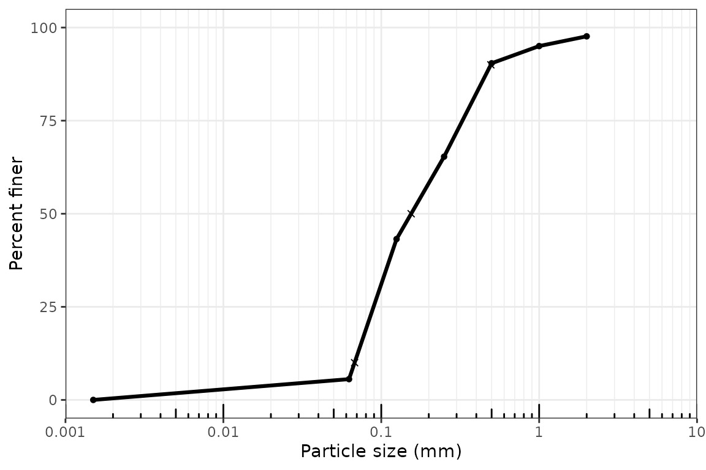
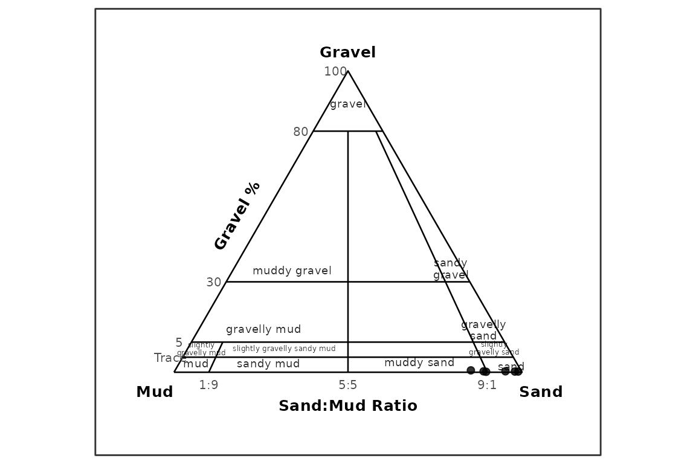
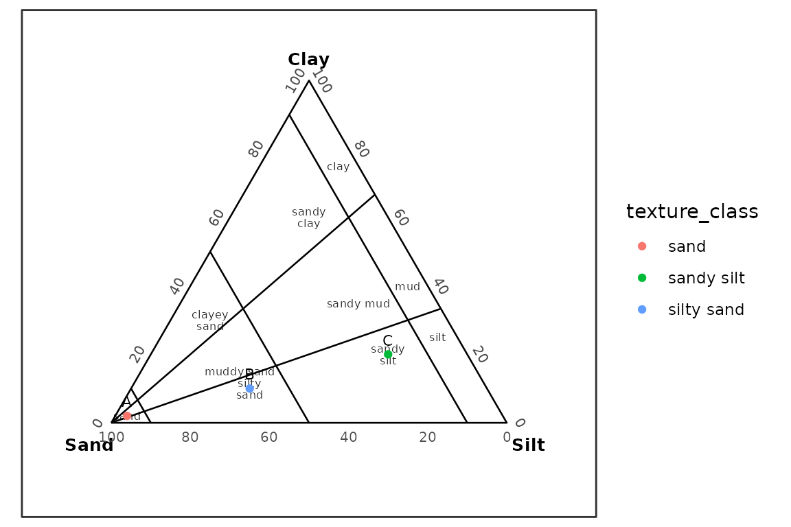

# Replacing GRADISTAT and G2Sd Workflows

## Purpose

This vignette shows how grainsizeR can serve as an R-native functional
replacement for many GRADISTAT and G2Sd-style grain-size analysis tasks.
It is not an Excel visual clone and does not claim byte-for-byte parity
with workbook printouts.

``` r
library(grainsizeR)
```

## What GRADISTAT and G2Sd Workflows Usually Provide

Typical workflows include importing retained grain-size data,
calculating D-values and graphical statistics, describing sediment
parameters, checking quality cautions, classifying texture, composing
sediment names, and producing distribution, cumulative, fraction, and
texture ternary plots.

## grainsizeR Equivalent Functions

| GRADISTAT / G2Sd output              | grainsizeR function                                                                                                                                                                | Notes                                                                                                                                                                           |
|--------------------------------------|------------------------------------------------------------------------------------------------------------------------------------------------------------------------------------|---------------------------------------------------------------------------------------------------------------------------------------------------------------------------------|
| Retained grain-size input            | [`read_gsd()`](https://Gavin987.github.io/grainsizeR/reference/read_gsd.md), [`read_gsd_wide()`](https://Gavin987.github.io/grainsizeR/reference/read_gsd_wide.md)                 | Long and wide retained tables are supported.                                                                                                                                    |
| D-values                             | [`gs_d_values()`](https://Gavin987.github.io/grainsizeR/reference/gs_d_values.md)                                                                                                  | Percentile grain sizes with explicit extrapolation behavior.                                                                                                                    |
| D-ratio and D-difference descriptors | [`gs_d_spread()`](https://Gavin987.github.io/grainsizeR/reference/gs_d_spread.md)                                                                                                  | GRADISTAT-style spread descriptors.                                                                                                                                             |
| Folk and Ward statistics             | [`gs_folk_ward()`](https://Gavin987.github.io/grainsizeR/reference/gs_folk_ward.md)                                                                                                | Graphical statistics in R tabular output.                                                                                                                                       |
| Moment statistics                    | [`gs_moments()`](https://Gavin987.github.io/grainsizeR/reference/gs_moments.md)                                                                                                    | Explicit open-end handling is required.                                                                                                                                         |
| Modes and modality                   | [`gs_modes()`](https://Gavin987.github.io/grainsizeR/reference/gs_modes.md)                                                                                                        | Ranked retained-class modes and sample modality.                                                                                                                                |
| Fraction percentages                 | [`gs_fractions()`](https://Gavin987.github.io/grainsizeR/reference/gs_fractions.md), [`gs_fractions_wide()`](https://Gavin987.github.io/grainsizeR/reference/gs_fractions_wide.md) | Built-in particle-size schemes.                                                                                                                                                 |
| Descriptive terms                    | [`gs_describe_parameters()`](https://Gavin987.github.io/grainsizeR/reference/gs_describe_parameters.md)                                                                            | GRADISTAT-style printout descriptors.                                                                                                                                           |
| Quality cautions                     | [`gs_quality_flags()`](https://Gavin987.github.io/grainsizeR/reference/gs_quality_flags.md)                                                                                        | Sediment loss and open fine-pan advisories.                                                                                                                                     |
| Summary table                        | [`gs_parameters()`](https://Gavin987.github.io/grainsizeR/reference/gs_parameters.md)                                                                                              | Combined R table for reporting.                                                                                                                                                 |
| Distribution plot                    | [`plot_distribution()`](https://Gavin987.github.io/grainsizeR/reference/plot_distribution.md)                                                                                      | ggplot output with metric and phi scales.                                                                                                                                       |
| Cumulative curve                     | [`plot_cumulative()`](https://Gavin987.github.io/grainsizeR/reference/plot_cumulative.md)                                                                                          | ggplot output with optional D-value markers.                                                                                                                                    |
| Fraction plot                        | [`plot_fractions()`](https://Gavin987.github.io/grainsizeR/reference/plot_fractions.md)                                                                                            | ggplot stacked bars by sample.                                                                                                                                                  |
| Texture classification               | [`classify_texture()`](https://Gavin987.github.io/grainsizeR/reference/classify_texture.md)                                                                                        | USDA and GRADISTAT rule paths plus user polygons.                                                                                                                               |
| Sediment names                       | [`gs_gradistat_sediment_name()`](https://Gavin987.github.io/grainsizeR/reference/gs_gradistat_sediment_name.md)                                                                    | GRADISTAT-style composition from texture classes.                                                                                                                               |
| Texture ternary plots                | [`plot_texture_ternary()`](https://Gavin987.github.io/grainsizeR/reference/plot_texture_ternary.md)                                                                                | Preferred terminology-correct alias; [`plot_texture_triangle()`](https://Gavin987.github.io/grainsizeR/reference/plot_texture_triangle.md) remains available for compatibility. |

Short aliases such as
[`gs_fw57()`](https://Gavin987.github.io/grainsizeR/reference/gs_fw57.md),
[`gs_frac()`](https://Gavin987.github.io/grainsizeR/reference/gs_frac.md),
[`gs_diag()`](https://Gavin987.github.io/grainsizeR/reference/gs_diag.md),
and
[`gs_qc()`](https://Gavin987.github.io/grainsizeR/reference/gs_qc.md)
are available for interactive work. The full names in the table remain
the clearest choices for reproducible scripts and method descriptions.

## Input Data

``` r
long_file <- system.file("extdata", "grain.long.csv", package = "grainsizeR")
wide_file <- system.file("extdata", "grain.wide.csv", package = "grainsizeR")

gs <- read_gsd(
  long_file,
  format = "long",
  sample_col = "sample",
  size_col = "size",
  value_col = "proportion",
  size_unit = "mm",
  value_type = "proportion"
)

gs_wide <- read_gsd(wide_file, format = "wide")

head(gs)
#> # A tibble: 6 × 13
#>   sample_id bin_id raw_size_um size_lower_um size_upper_um size_mid_um
#>   <chr>      <int>       <dbl>         <dbl>         <dbl>       <dbl>
#> 1 S01            1        2000          2000            NA        NA  
#> 2 S01            2        1000          1000          2000      1414. 
#> 3 S01            3         500           500          1000       707. 
#> 4 S01            4         250           250           500       354. 
#> 5 S01            5         125           125           250       177. 
#> 6 S01            6          63            63           125        88.7
#> # ℹ 7 more variables: size_mid_phi <dbl>, retained_percent <dbl>,
#> #   cum_finer_percent <dbl>, cum_coarser_percent <dbl>, is_open_lower <lgl>,
#> #   is_open_upper <lgl>, measurement_method <chr>
```

The wide dry-sieve example is used below for the GRADISTAT-style
gravel-sand-mud workflow. The long example includes finer fractions and
is used for USDA texture examples. Open-ended tails are not silently
extrapolated; calls that need extrapolation use
`extrapolate = "warn_linear"` explicitly.

## Summary Statistics

``` r
head(suppressWarnings(gs_parameters(
  gs,
  parameters = c("d_values", "indices", "folk_ward", "fractions"),
  d_values = c(10, 50, 90),
  fraction_scheme = "gradistat",
  extrapolate = "warn_linear"
)))
#> # A tibble: 6 × 41
#>   sample_id D10_um D50_um D90_um D25_um D30_um D60_um D75_um    Cu    Cc
#>   <chr>      <dbl>  <dbl>  <dbl>  <dbl>  <dbl>  <dbl>  <dbl> <dbl> <dbl>
#> 1 S01         40.9   123.   390.   76.9   84.5   158.   233.  3.87 1.10 
#> 2 S02         77.6   175.   412.  114.   128.    205.   267.  2.64 1.03 
#> 3 S03         69.5   151.   402.   91.3  100.    193.   278.  2.77 0.748
#> 4 S04         60.2   125.   395.   81.2   88.5   167.   258.  2.77 0.780
#> 5 S05         62.2   123.   410.   80.1   87.2   167.   270.  2.69 0.731
#> 6 S06         76.1   216.   439.  104.   115.    273.   346.  3.59 0.641
#> # ℹ 31 more variables: So_trask <dbl>, Sk_trask <dbl>,
#> #   fine_content_percent <dbl>, fine_threshold_um <dbl>, fine_equivalent <dbl>,
#> #   interpolation_scale <chr>, D5_um <dbl>, D16_um <dbl>, D84_um <dbl>,
#> #   D95_um <dbl>, D5_phi <dbl>, D16_phi <dbl>, D25_phi <dbl>, D50_phi <dbl>,
#> #   D75_phi <dbl>, D84_phi <dbl>, D95_phi <dbl>, mean_fw_phi <dbl>,
#> #   mean_fw_um <dbl>, sorting_fw_phi <dbl>, skewness_fw <dbl>,
#> #   kurtosis_fw <dbl>, any_extrapolated <lgl>, mean_size_class <chr>, …
```

## D-Values and Spread Descriptors

``` r
head(suppressWarnings(gs_d_values(gs, probs = c(10, 50, 90), extrapolate = "warn_linear")))
#> # A tibble: 6 × 7
#>   sample_id percentile grain_size_um grain_size_mm grain_size_phi
#>   <chr>          <dbl>         <dbl>         <dbl>          <dbl>
#> 1 S01               10          40.9        0.0409           4.61
#> 2 S01               50         123.         0.123            3.02
#> 3 S01               90         390.         0.390            1.36
#> 4 S02               10          77.6        0.0776           3.69
#> 5 S02               50         175.         0.175            2.51
#> 6 S02               90         412.         0.412            1.28
#> # ℹ 2 more variables: interpolation_scale <chr>, extrapolated <lgl>
head(suppressWarnings(gs_d_spread(gs, extrapolate = "warn_linear")))
#> # A tibble: 6 × 14
#>   sample_id   D10   D25   D50   D75   D90 d_value_unit D90_D10_ratio
#>   <chr>     <dbl> <dbl> <dbl> <dbl> <dbl> <chr>                <dbl>
#> 1 S01        40.9  76.9  123.  233.  390. um                    9.54
#> 2 S02        77.6 114.   175.  267.  412. um                    5.30
#> 3 S03        69.5  91.3  151.  278.  402. um                    5.79
#> 4 S04        60.2  81.2  125.  258.  395. um                    6.56
#> 5 S05        62.2  80.1  123.  270.  410. um                    6.60
#> 6 S06        76.1 104.   216.  346.  439. um                    5.77
#> # ℹ 6 more variables: D90_minus_D10 <dbl>, D75_D25_ratio <dbl>,
#> #   D75_minus_D25 <dbl>, D90_D10_log_ratio <dbl>, D75_D25_log_ratio <dbl>,
#> #   any_extrapolated <lgl>
```

## Modes and Modality

``` r
head(gs_modes(gs))
#> # A tibble: 6 × 12
#>   sample_id sample_modality  mode_rank mode_size_mm mode_size_um mode_phi
#>   <chr>     <chr>                <int>        <dbl>        <dbl>    <dbl>
#> 1 S01       trimodal_or_more         1       0.0887         88.7     3.49
#> 2 S01       trimodal_or_more         2       0.177         177.      2.5 
#> 3 S01       trimodal_or_more         3       0.354         354.      1.5 
#> 4 S02       unimodal                 1       0.177         177.      2.5 
#> 5 S02       unimodal                 2       0.0887         88.7     3.49
#> 6 S02       unimodal                 3       0.354         354.      1.5 
#> # ℹ 6 more variables: mode_class_lower_mm <dbl>, mode_class_upper_mm <dbl>,
#> #   mode_percent <dbl>, mode_class_label <chr>, is_open_interval <lgl>,
#> #   mode_status <chr>
```

## Descriptive Terms and Quality Flags

``` r
head(suppressWarnings(gs_describe_parameters(gs)))
#> # A tibble: 6 × 19
#>   sample_id bin_id raw_size_um size_lower_um size_upper_um size_mid_um
#>   <chr>      <int>       <dbl>         <dbl>         <dbl>       <dbl>
#> 1 S01            1        2000          2000            NA        NA  
#> 2 S01            2        1000          1000          2000      1414. 
#> 3 S01            3         500           500          1000       707. 
#> 4 S01            4         250           250           500       354. 
#> 5 S01            5         125           125           250       177. 
#> 6 S01            6          63            63           125        88.7
#> # ℹ 13 more variables: size_mid_phi <dbl>, retained_percent <dbl>,
#> #   cum_finer_percent <dbl>, cum_coarser_percent <dbl>, is_open_lower <lgl>,
#> #   is_open_upper <lgl>, measurement_method <chr>, mean_description <chr>,
#> #   sorting_description <chr>, skewness_description <chr>,
#> #   kurtosis_description <chr>, description_method <chr>,
#> #   description_status <chr>
head(gs_quality_flags(gs, sediment_loss_percent = c(S01 = 1.2, S02 = 2.4)))
#> # A tibble: 6 × 6
#>   sample_id quality_flag      quality_status     quality_value quality_threshold
#>   <chr>     <chr>             <chr>              <chr>         <chr>            
#> 1 S01       sediment_loss     ok                 1.2           <= 2%            
#> 2 S01       open_fine_tail    needs_additional_… TRUE          reported explici…
#> 3 S01       fine_pan_fraction needs_additional_… 2.9952675     1% info; 5% warn…
#> 4 S02       sediment_loss     warning            2.4           > 2%             
#> 5 S02       open_fine_tail    needs_additional_… TRUE          reported explici…
#> 6 S02       fine_pan_fraction needs_additional_… 1.9336191     1% info; 5% warn…
#> # ℹ 1 more variable: quality_message <chr>
```

## Texture Classification

USDA major texture classification uses sand, silt, and clay percentages.
USDA sand-size modifier subclasses remain future work.

``` r
usda_fractions <- suppressWarnings(gs_fractions_wide(
  gs,
  scheme = "usda",
  normalize = "fine_earth",
  extrapolate = "warn_linear"
))

usda_components <- c("sand_percent", "silt_percent", "clay_percent")
usda_fractions <- usda_fractions[
  stats::complete.cases(usda_fractions[usda_components]) &
    rowSums(usda_fractions[usda_components] >= 0 & usda_fractions[usda_components] <= 100) == 3 &
    abs(rowSums(usda_fractions[usda_components]) - 100) < 1e-6,
]

head(classify_texture(usda_fractions, scheme = "usda", method = "rules"))
#> # A tibble: 6 × 11
#>   sample_id  sand  silt  clay texture_class_id texture_class
#>   <chr>     <dbl> <dbl> <dbl> <chr>            <chr>        
#> 1 S01        87.5 12.5      0 sand             sand         
#> 2 S02       100    0        0 sand             sand         
#> 3 S03       100    0        0 sand             sand         
#> 4 S04        90.9  9.12     0 sand             sand         
#> 5 S05        92.2  7.76     0 sand             sand         
#> 6 S06       100    0        0 sand             sand         
#> # ℹ 5 more variables: classification_method <chr>, rule_status <chr>,
#> #   all_rule_matches <chr>, rule_conflict <lgl>, rule_gap <lgl>
```

GRADISTAT texture classification supports the gravel-sand-mud and
sand-silt-clay no-gravel bases.

``` r
gradistat_fractions <- suppressWarnings(gs_fractions_wide(gs_wide, scheme = "gravel_sand_mud"))
gradistat_fractions <- gradistat_fractions[
  stats::complete.cases(gradistat_fractions[c("gravel_percent", "sand_percent", "mud_percent")]),
]

ssc <- data.frame(
  sample_id = c("A", "B", "C"),
  sand = c(95, 60, 20),
  silt = c(3, 30, 60),
  clay = c(2, 10, 20)
)

gsm_classified <- classify_texture(
  head(gradistat_fractions, 6),
  scheme = "gradistat",
  method = "rules",
  basis = "gravel_sand_mud",
  include_sediment_name = TRUE
)

ssc_classified <- classify_texture(
  ssc,
  scheme = "gradistat",
  method = "rules",
  basis = "sand_silt_clay_no_gravel"
)

gsm_classified
#> # A tibble: 6 × 21
#>   sample_id gravel  sand    mud texture_class_id     texture_class ternary_basis
#>   <chr>      <dbl> <dbl>  <dbl> <chr>                <chr>         <chr>        
#> 1 S01        0.624  85.0 14.4   slightly_gravelly_m… slightly gra… gravel_sand_…
#> 2 S02        0.224  97.8  1.93  slightly_gravelly_s… slightly gra… gravel_sand_…
#> 3 S03        0.312  95.1  4.60  slightly_gravelly_s… slightly gra… gravel_sand_…
#> 4 S04        0.153  89.6 10.2   slightly_gravelly_m… slightly gra… gravel_sand_…
#> 5 S05        0.295  88.8 10.9   slightly_gravelly_m… slightly gra… gravel_sand_…
#> 6 S06        0.230  98.8  0.964 slightly_gravelly_s… slightly gra… gravel_sand_…
#> # ℹ 14 more variables: classification_method <chr>,
#> #   classification_status <chr>, notes <chr>, sand_mud_ratio <dbl>,
#> #   textural_group_class_id <chr>, textural_group <chr>,
#> #   mini_texture_class_id <chr>, mini_texture_class <chr>,
#> #   dominant_gravel_class <chr>, dominant_sand_class <chr>,
#> #   dominant_silt_class <chr>, sediment_name <chr>, sediment_name_status <chr>,
#> #   sediment_name_method <chr>
ssc_classified
#> # A tibble: 3 × 11
#>   sample_id  sand  silt  clay texture_class_id texture_class ternary_basis      
#>   <chr>     <dbl> <dbl> <dbl> <chr>            <chr>         <chr>              
#> 1 A            95     3     2 sand             sand          sand_silt_clay_no_…
#> 2 B            60    30    10 silty_sand       silty sand    sand_silt_clay_no_…
#> 3 C            20    60    20 sandy_silt       sandy silt    sand_silt_clay_no_…
#> # ℹ 4 more variables: classification_method <chr>, classification_status <chr>,
#> #   notes <chr>, silt_clay_ratio <dbl>
```

## Sediment Names

``` r
gs_gradistat_sediment_name(gsm_classified)
#> # A tibble: 6 × 21
#>   sample_id gravel  sand    mud texture_class_id     texture_class ternary_basis
#>   <chr>      <dbl> <dbl>  <dbl> <chr>                <chr>         <chr>        
#> 1 S01        0.624  85.0 14.4   slightly_gravelly_m… slightly gra… gravel_sand_…
#> 2 S02        0.224  97.8  1.93  slightly_gravelly_s… slightly gra… gravel_sand_…
#> 3 S03        0.312  95.1  4.60  slightly_gravelly_s… slightly gra… gravel_sand_…
#> 4 S04        0.153  89.6 10.2   slightly_gravelly_m… slightly gra… gravel_sand_…
#> 5 S05        0.295  88.8 10.9   slightly_gravelly_m… slightly gra… gravel_sand_…
#> 6 S06        0.230  98.8  0.964 slightly_gravelly_s… slightly gra… gravel_sand_…
#> # ℹ 14 more variables: classification_method <chr>,
#> #   classification_status <chr>, notes <chr>, sand_mud_ratio <dbl>,
#> #   textural_group_class_id <chr>, textural_group <chr>,
#> #   mini_texture_class_id <chr>, mini_texture_class <chr>,
#> #   dominant_gravel_class <chr>, dominant_sand_class <chr>,
#> #   dominant_silt_class <chr>, sediment_name <chr>, sediment_name_status <chr>,
#> #   sediment_name_method <chr>
```

## Distribution and Cumulative Plots

Metric distribution and cumulative plots use particle size in
millimetres on a log-scaled x-axis by default, with major breaks at
0.001, 0.01, 0.1, 1, and 10 mm. Distribution bars are centered at
particle-size classes. Use `particle_unit = "um"` for micrometre axes.
They show one sample at a time; loop over samples or arrange returned
plots externally for multi-sample figures. Lower open-ended classes are
displayed at 0.0015 mm, or 1.5 um, for plotting only; calculations are
unchanged.

``` r
plot_distribution(gs_wide, sample = "S01", cumulative = TRUE)
```


``` r
suppressWarnings(plot_cumulative(
  gs_wide,
  sample_id = "S01",
  show_percentiles = c(10, 50, 90),
  extrapolate = "warn_linear"
))
```



``` r
plot_fractions(
  gs_wide,
  scheme = "gravel_sand_mud",
  sample_id = c("S01", "S02"),
  fill_palette = "YlOrBr"
)
```


## Texture Ternary Plots

GRADISTAT gravel-sand-mud ternary plots place `Gravel` at the top, `Mud`
at the lower-left apex, and `Sand` at the lower-right apex. The plotting
functions draw ternary guides for gravel percentage and sand/mud ratio
directly on the diagram and suppress ordinary Cartesian x/y axes.

``` r
plot_texture_ternary(
  gsm_classified,
  scheme = "gradistat",
  basis = "gravel_sand_mud",
  point_id = "sample_id"
)
```



``` r

plot_texture_ternary(
  ssc_classified,
  scheme = "gradistat",
  basis = "sand_silt_clay_no_gravel",
  point_id = "sample_id"
)
```



## What Differs From Excel-Based GRADISTAT

grainsizeR returns R objects, not fixed spreadsheet worksheets. Plots
are ggplot objects and can be styled or combined with ordinary R tools.
The package does not copy GRADISTAT VBA code, chart objects, or workbook
printout layouts.

## What Is Not Claimed

This vignette does not claim full Excel visual parity, byte-for-byte
output identity, complete modified Udden-Wentworth subclass parity, or a
CRAN release claim. It demonstrates a functional replacement for the
implemented package scope.

## Remaining Future Work

Future work includes a separate CRAN-specific audit before any CRAN
submission and deferred features such as USDA sand-size modifier
subclasses, additional texture systems, and civil-engineering
classifications if they are scoped later.

## Reproducibility Advantages in R

An R-native script keeps import choices, extrapolation assumptions,
classification settings, plots, and output tables together. That makes
the analysis easier to rerun, review, and version-control than a manual
spreadsheet process.
