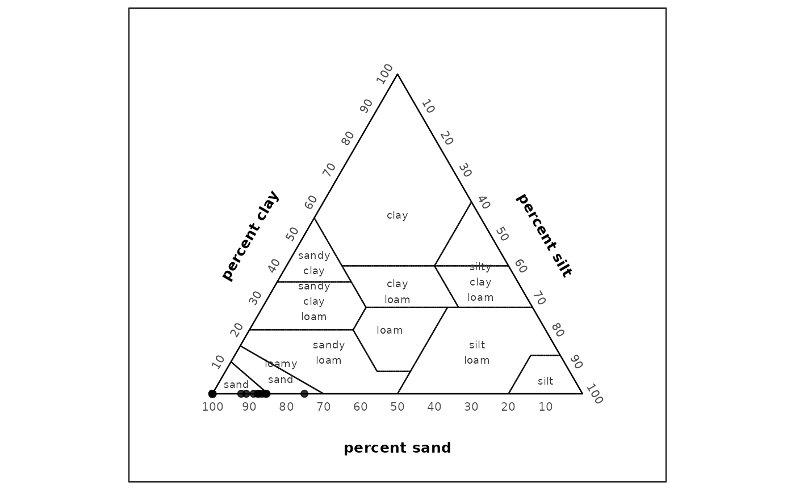
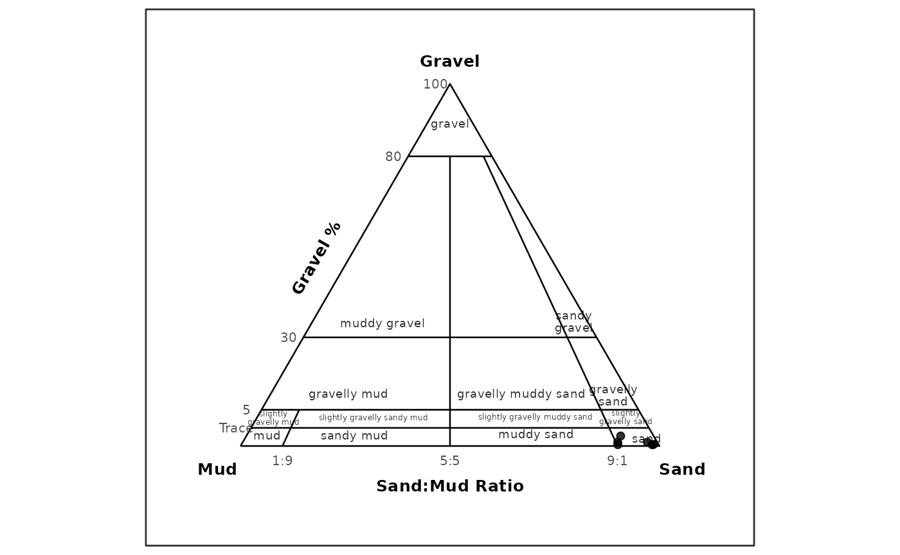
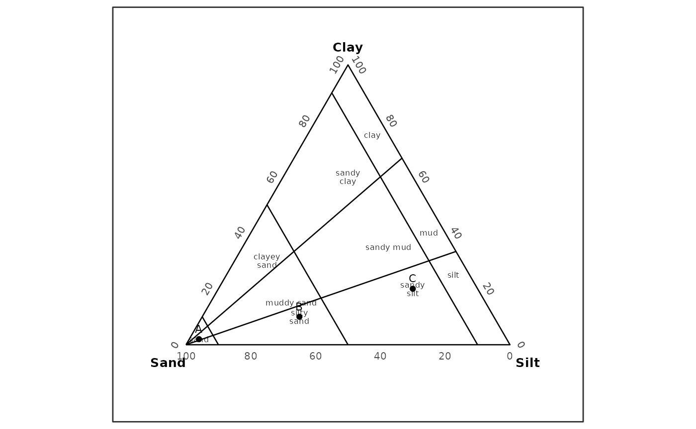

# Texture Classification

## Overview

[`classify_texture()`](https://gavin987.github.io/grainsizeR/reference/classify_texture.md)
provides two texture-classification paths:

- USDA 12-class major texture classification from sand, silt, and clay
  percentages.
- GRADISTAT-style rule classification for gravel-sand-mud textural
  groups and no-gravel sand-silt-clay mini texture classes.
- Generic classification against user-supplied ternary texture polygons.

The USDA path is rule-based. It does not require bundled USDA polygon
data, and no USDA polygon dataset is included as package data.

The GRADISTAT path is also rule-based. It uses source-grounded decision
tables from the user-provided GRADISTAT v8 workbook and the
textural-output context described by Blott and Pye (2001). Sediment-name
composition is available as a separate step or optional output.
GRADISTAT ternary plotting is available through
[`plot_texture_ternary()`](https://gavin987.github.io/grainsizeR/reference/plot_texture_ternary.md).

``` r
library(grainsizeR)
```

``` r
long_file <- system.file("extdata", "grain.long.csv", package = "grainsizeR")
wide_file <- system.file("extdata", "grain.wide.csv", package = "grainsizeR")

long_gs <- read_gsd(long_file)
wide_gs <- read_gsd(wide_file, format = "wide")
```

## USDA Major Texture Classification

Use `scheme = "usda"` and `method = "rules"` for the validated USDA
major-class workflow.

``` r
samples <- data.frame(
  sample_id = c("A", "B", "C"),
  sand = c(85, 40, 20),
  silt = c(10, 40, 20),
  clay = c(5, 20, 60)
)

classify_texture(samples, scheme = "usda", method = "rules")
#> # A tibble: 3 × 11
#>   sample_id  sand  silt  clay texture_class_id texture_class
#>   <chr>     <dbl> <dbl> <dbl> <chr>            <chr>        
#> 1 A            85    10     5 loamy_sand       loamy sand   
#> 2 B            40    40    20 loam             loam         
#> 3 C            20    20    60 clay             clay         
#> # ℹ 5 more variables: classification_method <chr>, rule_status <chr>,
#> #   all_rule_matches <chr>, rule_conflict <lgl>, rule_gap <lgl>
```

USDA texture ternary plotting is available through
[`plot_texture_ternary()`](https://gavin987.github.io/grainsizeR/reference/plot_texture_ternary.md).
The stable
[`plot_texture_triangle()`](https://gavin987.github.io/grainsizeR/reference/plot_texture_triangle.md)
function name remains available for compatibility. The bundled
long-format example includes finer fractions and can be used for the
USDA texture workflow. Some open-ended tails require explicit
extrapolation for resolved sand, silt, and clay percentages; this
example makes that assumption visible. USDA ternary plots draw the 12
major-class boundaries from the package’s independently expressed rule
logic and annotate ternary percentage axes directly, without ordinary
Cartesian x/y tick labels. USDA ternary plots place `percent sand`,
`percent silt`, and `percent clay` outside the corresponding triangle
sides. Samples whose finest measured boundary is too far from USDA’s 2
um clay threshold for the extrapolation to be reliable are excluded
rather than shown as a silent guess; a small extrapolation-driven
overshoot past the natural 0% clay boundary is clipped to 0 and the
difference proportionally redistributed across sand/silt so percentages
still sum to exactly 100.

``` r
usda_fractions <- suppressWarnings(gs_fractions_wide(
  long_gs,
  scheme = "usda",
  normalize = "fine_earth",
  extrapolate = "warn_linear"
))

usda_components <- c("sand_percent", "silt_percent", "clay_percent")
usda_matrix <- as.matrix(usda_fractions[usda_components])
usda_clipped <- pmax(usda_matrix, 0)
usda_clip_correction <- rowSums(usda_matrix) - rowSums(usda_clipped)
usda_keep <- stats::complete.cases(usda_matrix) &
  apply(usda_matrix, 1, function(row) all(is.finite(row))) &
  (-usda_clip_correction) <= 10
usda_fractions[usda_components] <- usda_clipped / rowSums(usda_clipped) * 100
usda_fractions <- usda_fractions[usda_keep, ]

head(classify_texture(usda_fractions, scheme = "usda", method = "rules"))
#> # A tibble: 6 × 11
#>   sample_id  sand  silt  clay texture_class_id texture_class
#>   <chr>     <dbl> <dbl> <dbl> <chr>            <chr>        
#> 1 S01        86.4 13.6      0 sand             sand         
#> 2 S04        86.4 13.6      0 sand             sand         
#> 3 S05        90.7  9.29     0 sand             sand         
#> 4 S19        83.5 16.5      0 loamy_sand       loamy sand   
#> 5 S20        86.2 13.8      0 sand             sand         
#> 6 S21        82.4 17.6      0 loamy_sand       loamy sand   
#> # ℹ 5 more variables: classification_method <chr>, rule_status <chr>,
#> #   all_rule_matches <chr>, rule_conflict <lgl>, rule_gap <lgl>

plot_texture_ternary(usda_fractions, scheme = "usda", labels = FALSE)
```



Input percentages must be numeric, finite, between 0 and 100, and sum to
approximately 100.
[`classify_texture()`](https://gavin987.github.io/grainsizeR/reference/classify_texture.md)
does not silently normalize invalid sand, silt, and clay sums.

Data frames with ternary `left`, `right`, and `top` columns are also
accepted for USDA rules. They are interpreted as `left = sand`,
`right = silt`, and `top = clay`.

## Method Selection

`method = "auto"` chooses the USDA rule path when `scheme = "usda"` and
no texture polygons are supplied. It also chooses GRADISTAT rules when
`scheme = "gradistat"` and no texture polygons are supplied.

``` r
classify_texture(samples, scheme = "usda", method = "auto")
#> # A tibble: 3 × 11
#>   sample_id  sand  silt  clay texture_class_id texture_class
#>   <chr>     <dbl> <dbl> <dbl> <chr>            <chr>        
#> 1 A            85    10     5 loamy_sand       loamy sand   
#> 2 B            40    40    20 loam             loam         
#> 3 C            20    20    60 clay             clay         
#> # ℹ 5 more variables: classification_method <chr>, rule_status <chr>,
#> #   all_rule_matches <chr>, rule_conflict <lgl>, rule_gap <lgl>
```

`method = "rules"` supports `scheme = "usda"` and
`scheme = "gradistat"`. Other schemes require user-supplied polygons
because grainsizeR does not bundle built-in texture polygon datasets
yet.

`method = "polygon"` uses the generic user-supplied polygon workflow.

## GRADISTAT Texture Classification

Use `scheme = "gradistat"` and `method = "rules"` for GRADISTAT-style
texture classification. The `gravel_sand_mud` basis accepts `gravel`,
`sand`, and `mud` percentage columns, official `gravel_sand_mud`
fraction output, or official `gradistat` fraction output where `silt`
and `clay` are aggregated to mud. The bundled dry-sieve wide example
supports this GRADISTAT-style gravel-sand-mud workflow.

``` r
wide_gradistat <- suppressWarnings(gs_fractions_wide(wide_gs, scheme = "gravel_sand_mud"))
wide_gradistat <- wide_gradistat[
  stats::complete.cases(wide_gradistat[c("gravel_percent", "sand_percent", "mud_percent")]),
]

classify_texture(
  head(wide_gradistat, 6),
  scheme = "gradistat",
  method = "rules",
  basis = "gravel_sand_mud",
  include_sediment_name = TRUE
)
#> # A tibble: 6 × 21
#>   sample_id gravel  sand    mud texture_class_id     texture_class ternary_basis
#>   <chr>      <dbl> <dbl>  <dbl> <chr>                <chr>         <chr>        
#> 1 S01        0.624  85.0 14.4   slightly_gravelly_m… slightly gra… gravel_sand_…
#> 2 S02        0.224  97.8  1.93  slightly_gravelly_s… slightly gra… gravel_sand_…
#> 3 S03        0.312  95.1  4.60  slightly_gravelly_s… slightly gra… gravel_sand_…
#> 4 S04        0.153  89.6 10.2   slightly_gravelly_m… slightly gra… gravel_sand_…
#> 5 S05        0.295  88.8 10.9   slightly_gravelly_m… slightly gra… gravel_sand_…
#> 6 S06        0.230  98.8  0.964 slightly_gravelly_s… slightly gra… gravel_sand_…
#> # ℹ 14 more variables: classification_method <chr>,
#> #   classification_status <chr>, notes <chr>, sand_mud_ratio <dbl>,
#> #   textural_group_class_id <chr>, textural_group <chr>,
#> #   mini_texture_class_id <chr>, mini_texture_class <chr>,
#> #   dominant_gravel_class <chr>, dominant_sand_class <chr>,
#> #   dominant_silt_class <chr>, sediment_name <chr>, sediment_name_status <chr>,
#> #   sediment_name_method <chr>
```

The `sand_silt_clay_no_gravel` basis requires `sand`, `silt`, and `clay`
percentage columns.

``` r
ssc <- data.frame(
  sample_id = c("A", "B", "C"),
  sand = c(95, 60, 20),
  silt = c(3, 30, 60),
  clay = c(2, 10, 20)
)

classify_texture(
  ssc,
  scheme = "gradistat",
  method = "rules",
  basis = "sand_silt_clay_no_gravel"
)
#> # A tibble: 3 × 11
#>   sample_id  sand  silt  clay texture_class_id texture_class ternary_basis      
#>   <chr>     <dbl> <dbl> <dbl> <chr>            <chr>         <chr>              
#> 1 A            95     3     2 sand             sand          sand_silt_clay_no_…
#> 2 B            60    30    10 silty_sand       silty sand    sand_silt_clay_no_…
#> 3 C            20    60    20 sandy_silt       sandy silt    sand_silt_clay_no_…
#> # ℹ 4 more variables: classification_method <chr>, classification_status <chr>,
#> #   notes <chr>, silt_clay_ratio <dbl>
```

GRADISTAT rule classification returns `texture_class_id`,
`texture_class`, `classification_method`, `classification_status`,
`ternary_basis`, `notes`, and a ratio audit column. Input percentages
must sum to approximately 100 for the selected basis; grainsizeR does
not silently normalize invalid sums.

`TEXTURAL GROUP` and `SEDIMENT NAME` are distinct GRADISTAT-style
outputs. Sediment-name composition can be requested during GRADISTAT
classification with `include_sediment_name = TRUE`, or added afterward
with
[`gs_gradistat_sediment_name()`](https://gavin987.github.io/grainsizeR/reference/gs_gradistat_sediment_name.md).
If dominant size-subclass columns are missing, the textural group is
returned as a partial sediment name.

The same supported bases can be drawn as texture ternary plots. For the
dry-sieve wide example, sample labels are suppressed to keep the
GRADISTAT gravel-sand-mud class labels readable. In the gravel-sand-mud
basis, the ternary plot places `Gravel` at the top, `Mud` at the
lower-left apex, and `Sand` at the lower-right apex. Gravel percentage
guides and sand/mud ratio guides are drawn as ternary annotations rather
than Cartesian axes; unlike the USDA display, these GRADISTAT apex
labels remain at the vertices.

``` r
plot_texture_ternary(
  head(wide_gradistat, 6),
  scheme = "gradistat",
  basis = "gravel_sand_mud",
  point_id = "sample_id",
  show_sample_labels = FALSE
)
```



``` r

plot_texture_ternary(
  ssc,
  scheme = "gradistat",
  basis = "sand_silt_clay_no_gravel",
  point_id = "sample_id"
)
```



Distribution, cumulative, fraction, USDA texture ternary, and GRADISTAT
texture ternary plots are R-native functional replacements, not Excel
visual clones.

[`plot_texture_ternary()`](https://gavin987.github.io/grainsizeR/reference/plot_texture_ternary.md)
is the preferred plotting name in new examples.
[`plot_texture_triangle()`](https://gavin987.github.io/grainsizeR/reference/plot_texture_triangle.md)
remains available as an equivalent compatibility alias, while
[`plot_trigon()`](https://gavin987.github.io/grainsizeR/reference/plot_trigon.md)
is retained for legacy raw-data ternary workflows.

## Output Columns

USDA rule classification returns the input rows with these
classification columns appended:

- `texture_class_id`
- `texture_class`
- `classification_method`
- `rule_status`
- `all_rule_matches`
- `rule_conflict`
- `rule_gap`

For valid, clean USDA inputs, `classification_method` is
`"usda_major_rules"` and `rule_status` is `"classified"`.

Polygon classification also reports public class labels with
`texture_class_id` and `texture_class`, while retaining polygon-specific
component, coordinate, and status columns such as `left`, `right`,
`top`, `x`, `y`, `resolved`, and `ambiguous`.

## User-Supplied Polygon Classification

Generic polygon classification remains available for user-provided
texture systems. The example below defines a synthetic full ternary
region for demonstration only; it is not an official texture system.

``` r
polygons <- data.frame(
  scheme = "synthetic_ternary",
  class_id = "all",
  class_name = "Synthetic full ternary area",
  vertex_id = 1:3,
  left = c(100, 0, 0),
  right = c(0, 100, 0),
  top = c(0, 0, 100),
  left_component = "sand",
  right_component = "silt",
  top_component = "clay",
  reference_id = NA_character_,
  reference = NA_character_
)

polygons <- validate_texture_polygons(polygons)
```

``` r
synthetic <- data.frame(
  sample_id = rep("A", 4),
  size_mm = c(2, 0.05, 0.002, 0.001),
  retained = c(10, 40, 30, 20)
)

synthetic_gs <- as_gsd_tbl(
  synthetic,
  sample_id,
  size_mm,
  retained,
  value_type = "percent"
)

classify_texture(
  synthetic_gs,
  texture_polygons = polygons,
  scheme = "synthetic_ternary",
  method = "polygon"
)
#> # A tibble: 1 × 13
#>   sample_id scheme  texture_class_id texture_class  left right   top     x     y
#>   <chr>     <chr>   <chr>            <chr>         <dbl> <dbl> <dbl> <dbl> <dbl>
#> 1 A         synthe… all              Synthetic fu…    40    30    20 0.444 0.192
#> # ℹ 4 more variables: resolved <lgl>, ambiguous <lgl>, normalize <chr>,
#> #   interpolation_scale <chr>
```

## Limitations

The USDA workflow covers only the 12 major USDA textural classes.
Sand-size modifier subclasses such as coarse sand, fine sand, very fine
sand, coarse sandy loam, fine sandy loam, and very fine sandy loam are
not implemented. They may be considered later as qualitative descriptor
columns for D50 or particle-size summaries.

No USDA polygon dataset or USDA rule-data object is bundled as runtime
package data.

GRADISTAT gravel-sand-mud and sand-silt-clay no-gravel ternary plotting
is implemented through
[`plot_texture_ternary()`](https://gavin987.github.io/grainsizeR/reference/plot_texture_ternary.md).
Full Excel visual parity is not claimed.

CRAN readiness is not claimed in this vignette.

## Provenance and Validation

The public USDA classification path uses an internal rule helper
validated against USDA/NRCS validation examples and boundary cases.
Public API tests cover representative official, targeted, and boundary
points.

Performance notes are informational. The USDA rule classifier is
vectorized and expected to be lighter than repeated polygon
point-in-polygon checks for this built-in USDA path, but formal
benchmarking is not included.

The public GRADISTAT classification path uses independently written R
decision rules based on the documented GRADISTAT behavior. The workbook
was used only as a reference implementation, and VBA source code was not
copied.
