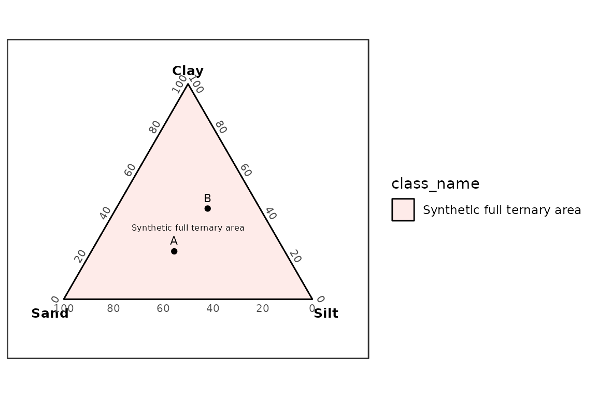

# User-Supplied Texture Polygons

## Overview

Particle-size fraction schemes define boundaries such as clay, silt,
sand, and gravel limits. Texture class polygons define regions in a
ternary diagram. The two are related, but they are not the same data
object.

grainsizeR includes particle-size fraction schemes and a framework for
user-supplied texture polygons. Official built-in polygon datasets are
not included yet because they need to be compiled from original official
or academic sources with citations.

``` r
library(grainsizeR)

texture_polygon_sources()
#> # A tibble: 11 × 9
#>    scheme       scheme_name  particle_size_system left_component right_component
#>    <chr>        <chr>        <chr>                <chr>          <chr>          
#>  1 usda         USDA textur… usda                 sand           silt           
#>  2 hypres       HYPRES text… hypres               sand           silt           
#>  3 isss         Internation… isss                 sand           silt           
#>  4 uk_ssew      UK SSEW tex… uk_ssew              sand           silt           
#>  5 gradistat    GRADISTAT t… gradistat            sand           silt           
#>  6 australia_20 Australia 2… australia_20         sand           silt           
#>  7 germany_63   Germany 63 … germany_63           sand           silt           
#>  8 canada_50    Canada 50 u… canada_50            sand           silt           
#>  9 belgium_50   Belgium 50 … belgium_50           sand           silt           
#> 10 fr_aisne     French Aisn… fr_aisne             sand           silt           
#> 11 fr_geppa     French GEPP… fr_geppa             sand           silt           
#> # ℹ 4 more variables: top_component <chr>, polygon_status <chr>,
#> #   primary_source <chr>, notes <chr>
```

USDA 12-class major texture ternary classification is available without
a bundled polygon dataset by using the validated internal rule path
through
[`classify_texture()`](https://Gavin987.github.io/grainsizeR/reference/classify_texture.md).

``` r
samples <- data.frame(
  sample_id = c("A", "B", "C"),
  sand = c(90, 40, 20),
  silt = c(5, 40, 20),
  clay = c(5, 20, 60)
)

classify_texture(samples, scheme = "usda", method = "rules")
#> # A tibble: 3 × 11
#>   sample_id  sand  silt  clay texture_class_id texture_class
#>   <chr>     <dbl> <dbl> <dbl> <chr>            <chr>        
#> 1 A            90     5     5 sand             sand         
#> 2 B            40    40    20 loam             loam         
#> 3 C            20    20    60 clay             clay         
#> # ℹ 5 more variables: classification_method <chr>, rule_status <chr>,
#> #   all_rule_matches <chr>, rule_conflict <lgl>, rule_gap <lgl>
```

This USDA rule path covers only the 12 major classes and does not
include sand-size modifier subclasses. User-supplied polygon
classification remains the generic workflow for other texture systems.

## Creating a Polygon Data Frame

[`texture_polygon_template()`](https://Gavin987.github.io/grainsizeR/reference/texture_polygon_template.md)
shows the required columns. The synthetic example below defines a single
class covering the full ternary triangle. It is not an official texture
classification system.

``` r
texture_polygon_template()
#> # A tibble: 0 × 12
#> # ℹ 12 variables: scheme <chr>, class_id <chr>, class_name <chr>,
#> #   vertex_id <int>, left <dbl>, right <dbl>, top <dbl>, left_component <chr>,
#> #   right_component <chr>, top_component <chr>, reference_id <chr>,
#> #   reference <chr>

polygons <- data.frame(
  scheme = "synthetic_ternary",
  class_id = "all",
  class_name = "Synthetic full ternary area",
  vertex_id = 1:3,
  left = c(100, 0, 0),
  right = c(0, 100, 0),
  top = c(0, 0, 100),
  left_component = "sand",
  right_component = "silt",
  top_component = "clay",
  reference_id = NA_character_,
  reference = NA_character_
)

polygons <- validate_texture_polygons(polygons)
polygons
#> # A tibble: 3 × 12
#>   scheme          class_id class_name vertex_id  left right   top left_component
#>   <chr>           <chr>    <chr>          <dbl> <dbl> <dbl> <dbl> <chr>         
#> 1 synthetic_tern… all      Synthetic…         1   100     0     0 sand          
#> 2 synthetic_tern… all      Synthetic…         2     0   100     0 sand          
#> 3 synthetic_tern… all      Synthetic…         3     0     0   100 sand          
#> # ℹ 4 more variables: right_component <chr>, top_component <chr>,
#> #   reference_id <chr>, reference <chr>
```

## Classifying Samples

This synthetic grain-size table has finite boundaries at the USDA-style
sand, silt, and clay thresholds used by the example polygon axes.

``` r
synthetic <- data.frame(
  sample_id = rep(c("A", "B"), each = 4),
  size_mm = rep(c(2, 0.05, 0.002, 0.001), 2),
  retained = c(10, 40, 30, 20, 5, 20, 35, 40)
)

synthetic_gs <- as_gsd_tbl(
  synthetic,
  sample_id,
  size_mm,
  retained,
  value_type = "percent"
)

classify_texture(
  synthetic_gs,
  polygons = polygons,
  scheme = "synthetic_ternary"
)
#> # A tibble: 2 × 13
#>   sample_id scheme  texture_class_id texture_class  left right   top     x     y
#>   <chr>     <chr>   <chr>            <chr>         <dbl> <dbl> <dbl> <dbl> <dbl>
#> 1 A         synthe… all              Synthetic fu…    40    30    20 0.444 0.192
#> 2 B         synthe… all              Synthetic fu…    20    35    40 0.579 0.365
#> # ℹ 4 more variables: resolved <lgl>, ambiguous <lgl>, normalize <chr>,
#> #   interpolation_scale <chr>
```

## Plotting User Polygons

[`plot_texture_ternary()`](https://Gavin987.github.io/grainsizeR/reference/plot_texture_ternary.md)
can draw sample points and user-supplied polygons.
[`plot_texture_triangle()`](https://Gavin987.github.io/grainsizeR/reference/plot_texture_triangle.md)
remains available as a compatibility function name.

``` r
plot_texture_ternary(
  synthetic_gs,
  polygons = polygons,
  scheme = "synthetic_ternary"
)
```


