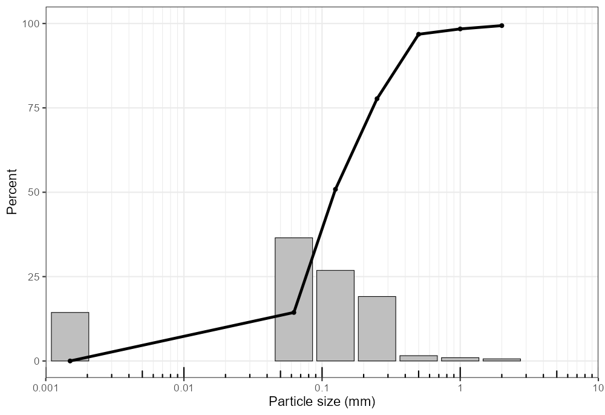
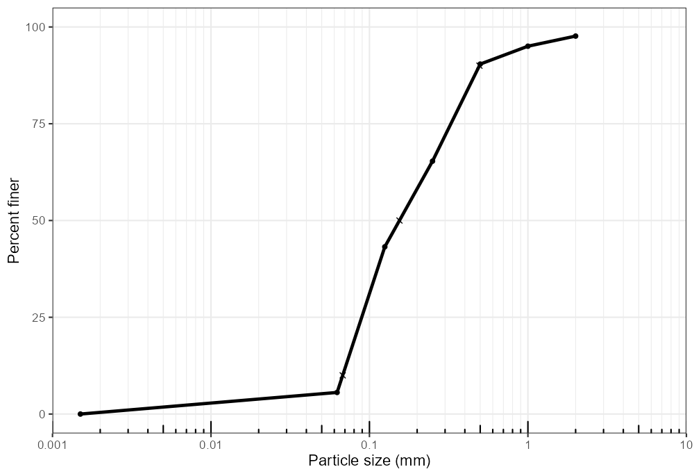
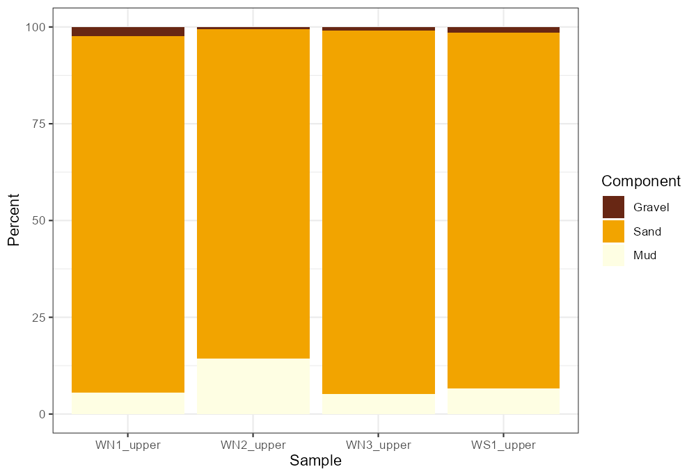
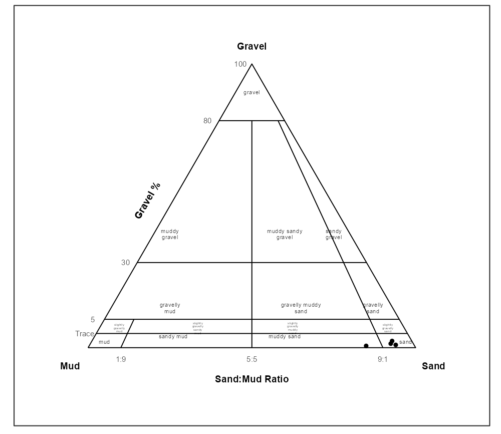
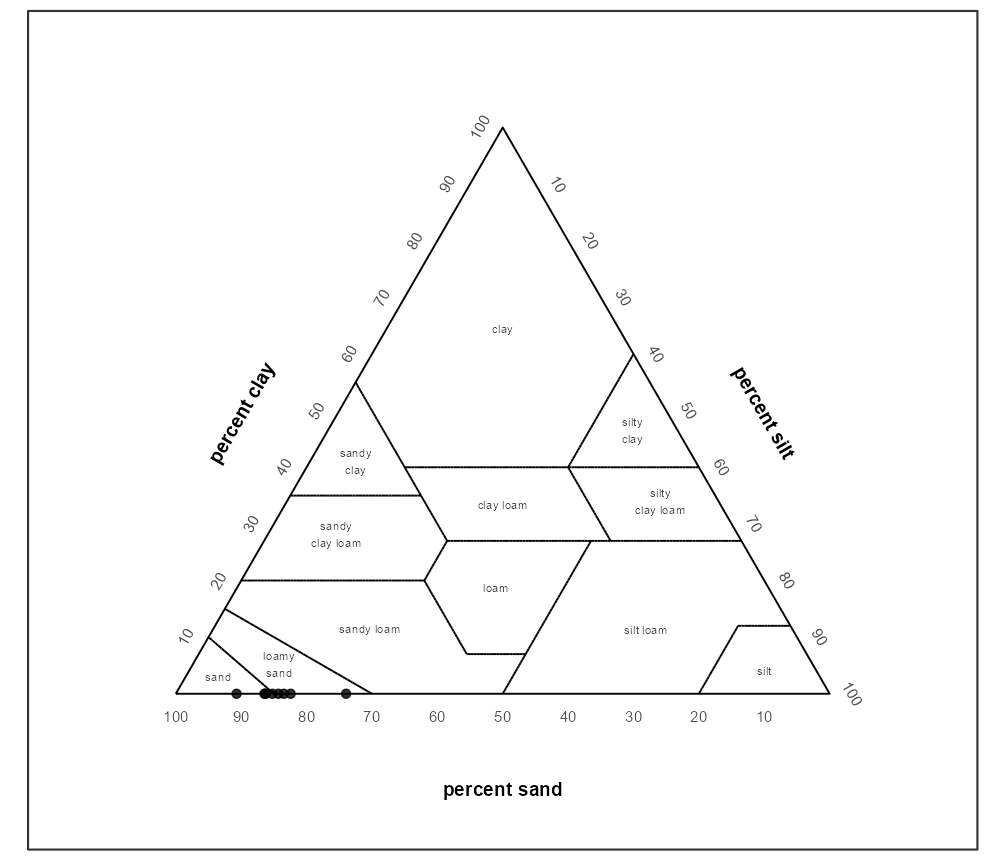

# grainsizeR

[](https://doi.org/10.5281/zenodo.21169393)

grainsizeR provides R tools for sediment grain-size analysis. It reads
retained grain-size distributions, validates them as `gsd_tbl` objects,
calculates D-values and common summary statistics, builds particle-size
fraction summaries, classifies supported texture systems, and creates
distribution, cumulative, fraction, and texture ternary plots.

## Installation

``` r
install.packages("remotes")
remotes::install_github("Gavin987/grainsizeR")
```

grainsizeR is under active development. Built-in official texture
polygon datasets are not bundled yet; USDA major texture and
GRADISTAT-style texture classification are available through internal
rule helpers.

## Quick Start

The bundled examples include a wide dry-sieve table and a long-format
sieve-plus-hydrometer table.

``` r
library(grainsizeR)

wide_path <- system.file("extdata", "grain.wide.csv", package = "grainsizeR")
long_path <- system.file("extdata", "grain.long.csv", package = "grainsizeR")

wide <- read_gsd(wide_path, format = "wide")
long <- read_gsd(long_path)
```

Once imported, use the same object with summary and plotting functions:

``` r
gs_diagnostics(wide, output = "summary")
gs_d_values(long, probs = c(10, 50, 90), extrapolate = "warn_linear")
gs_folk_ward(long, extrapolate = "warn_linear")
gradistat_components <- gs_fractions_wide(wide, scheme = "gradistat")
gs_fractions_wide(wide, scheme = "gravel_sand_mud")
```

## Grain-Size Plots

Distribution and cumulative plots are single-sample displays. Select one
sample with `sample = 1` or `sample = "S01"`, then loop over samples or
arrange returned plots externally for multi-sample figures. Metric plots
use a log10 particle-size axis in millimetres by default;
`particle_unit = "um"` displays micrometres.

``` r
plot_distribution(wide, sample = 1, cumulative = TRUE)
plot_cumulative(
  wide,
  sample = "S01",
  show_percentiles = TRUE,
  extrapolate = "warn_linear"
)

samples <- unique(wide$sample_id)
plots <- lapply(samples, function(id) {
  plot_distribution(wide, sample = id)
})
```



## Fraction Summaries

The dry-sieve wide example demonstrates the GRADISTAT-style
`Gravel`/`Sand`/`Mud` breakdown. More detailed Wentworth-style fractions
are available when the input resolves the required class boundaries. The
bundled dry-sieve example uses the GRADISTAT-compatible
`gravel_sand_mud` basis with a 63 um sand/mud boundary. This differs
intentionally from the strict Wentworth `wentworth_major` scheme, which
uses the 62.5 um sand/silt boundary.

``` r
plot_fractions(
  wide,
  scheme = "gravel_sand_mud",
  sample = 1:10,
  fill_palette = "YlOrBr"
)
```



## Texture Ternary Plots

Fraction schemes convert grain-size data into particle-size components;
ternary bases are the three components drawn on a plot; texture systems
are the classification or diagram style. GRADISTAT-style ternary plots
accept official
[`gs_fractions_wide()`](https://gavin987.github.io/grainsizeR/reference/gs_fractions_wide.md)
outputs from the `gradistat` or `gravel_sand_mud` schemes. USDA ternary
plots accept official USDA fraction output and draw the 12 major USDA
texture classes. Canonical component names are lowercase snake_case;
simple case variants such as `Sand` or `SAND` are normalized internally.

``` r
gradistat_components <- gs_fractions_wide(wide, scheme = "gradistat")
usda_components <- gs_fractions_wide(
  long,
  scheme = "usda",
  normalize = "fine_earth",
  extrapolate = "warn_linear"
)

plot_texture_ternary(gradistat_components, scheme = "gradistat")
plot_texture_ternary(usda_components, scheme = "usda", show_sample_labels = TRUE)
```

The USDA panel below plots only the samples whose clay/silt split
resolves from real or explicitly-extrapolated
(`extrapolate = "warn_linear"`, with a warning) fine-boundary data;
samples where that extrapolation would be unreliably large are omitted
rather than shown as a silent guess.



## Parameter Summaries

[`gs_parameters()`](https://gavin987.github.io/grainsizeR/reference/gs_parameters.md)
collects common grain-size outputs into ordinary R tables for reporting
or export with standard R tools.

``` r
summary <- gs_parameters(
  long,
  parameters = c("d_values", "indices", "folk_ward", "fractions"),
  fraction_scheme = "gradistat",
  extrapolate = "warn_linear"
)

write.csv(summary, "grain_size_summary.csv", row.names = FALSE)
```

## End-to-End Workflow

The full vignettes walk through complete analyses. A compact pass
usually reads data, checks resolvability, calculates statistics, then
creates figures:

``` r
long <- read_gsd(long_path)

gs_diagnostics(long, output = "summary")
gs_parameters(
  long,
  parameters = c("d_values", "indices", "folk_ward", "fractions"),
  fraction_scheme = "gradistat",
  extrapolate = "warn_linear"
)

plot_distribution(long, sample = "S01", cumulative = TRUE)
plot_cumulative(long, sample = "S01", extrapolate = "warn_linear")
plot_fractions(long, scheme = "wentworth_major")
usda_components <- gs_fractions_wide(long, scheme = "usda", normalize = "fine_earth")
plot_texture_ternary(usda_components, scheme = "usda")
```

[`plot_texture_ternary()`](https://gavin987.github.io/grainsizeR/reference/plot_texture_ternary.md)
is preferred in new code;
[`plot_texture_triangle()`](https://gavin987.github.io/grainsizeR/reference/plot_texture_triangle.md)
remains available as an equivalent compatibility alias. Legacy raw-data
ternary plotting remains available through
[`plot_trigon()`](https://gavin987.github.io/grainsizeR/reference/plot_trigon.md).

## Further Reading

Use the vignettes for complete examples and methodological detail:

- [`vignette("basic-workflow")`](https://gavin987.github.io/grainsizeR/articles/basic-workflow.md):
  a compact first-pass import, summary, and plot walkthrough.
- [`vignette("grain-size-workflow")`](https://gavin987.github.io/grainsizeR/articles/grain-size-workflow.md):
  import, diagnostics, summaries, and plots.
- [`vignette("table-layouts-and-measurement-workflows")`](https://gavin987.github.io/grainsizeR/articles/table-layouts-and-measurement-workflows.md):
  long and wide table layouts for common measurement setups.
- [`vignette("texture-classification")`](https://gavin987.github.io/grainsizeR/articles/texture-classification.md):
  USDA and GRADISTAT-style texture classification and ternary plots.
- [`vignette("texture-polygons")`](https://gavin987.github.io/grainsizeR/articles/texture-polygons.md):
  user-supplied polygon templates and polygon classification steps.
- [`vignette("replacing-gradistat-g2sd")`](https://gavin987.github.io/grainsizeR/articles/replacing-gradistat-g2sd.md):
  R-native approaches to tasks commonly handled with GRADISTAT or
  G2Sd-style analysis.
- [`vignette("method-validation")`](https://gavin987.github.io/grainsizeR/articles/method-validation.md):
  interpolation conventions, open-tail behavior, and numerical
  validation examples.

Function documentation gives argument-level detail, including explicit
extrapolation and open-ended class handling.

## License and Development Status

grainsizeR is licensed under the MIT License. Package code and original
package documentation are MIT-licensed.

The package is in active development. It does not copy GRADISTAT VBA
code, G2Sd source code, workbook layouts, `soiltexture` code, or bundled
official texture polygon coordinates. Built-in official texture polygon
datasets may be added only after independent source review,
reconstruction, validation, tests, and documentation.

The public provenance notes document source boundaries before any future
built-in texture polygon dataset is considered.

## Citation

If you use grainsizeR, please cite the package. The latest archived
Zenodo version DOI currently available is for v0.2.0; the v0.3.0 archive
will be added after the v0.3.0 GitHub Release is created.

Chang, C.-S. G. (2026). grainsizeR: Sediment Grain-Size Analysis Tools
(v0.2.0). Zenodo. <https://doi.org/10.5281/zenodo.21169394>
